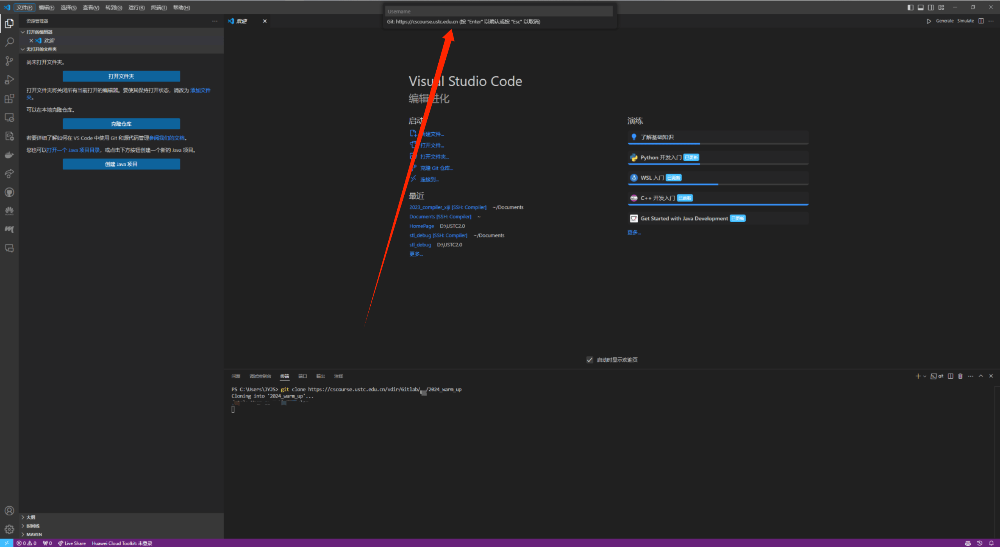

# FAQ

## Lab 0

### Q1: 环境配置相关

**A** : 助教会在在 9 月 8 日和 15 日晚 11～12 节 在 GTB-212 准时刷新，为大家解决环境相关问题。也欢迎大家 QQ 联系助教。

### Q2: `git clone` 指令卡住不动



**A** : 是因为 VSCode 一直在等你输入用户名和密码 (希冀平台 Gitlab)。

### Q3: `Segmentation Fault` 好难 debug！

**A** : 请参考[如何在 CMake 构建的大型项目中定位 Segmentation Fault](../lab0/debug.md#如何在-cmake-构建的大型项目中定位-segmentation-fault)一节。

## Lab 1

### Q1：Bison warning: nonterminal useless in grammar: call（这里以`call`非终结符为例） [-Wother]?

**A1**：针对**非终结符**（nonterminal）的警告，表示某个非终结符在语法中没有起到实际作用，可能是它没有被其他规则引用，或者语法分析的过程中没有使用到它。潜在的原因在于使用 call 这个非终结符虽然被定义了，但没有出现在任何可以触发它的规则中，也没有输入来调用它。需要检查其前后的产生式

### Q2：Bison warning: rule useless in grammar?

**A2**：针对**具体的规则**的警告，表示某个产生式规则是无用的，即使该规则在语法中定义了，但没有其他规则或输入会触发它。语法中的某个产生式规则虽然存在，但它可能没有与任何其他规则进行连接，也没有输入触发它。如 $A \rightarrow B~C$，$B$ 与 $C$均未被引用，需检查$B$和$C$的产生式。

### Q3：对于多行注释的词法分析代码说明

**A3**：

Cminusf 不会出现嵌套注释，但需要考虑 `/* * */` 及 `/* / */ `，还有多行注释。

处理注释可以使用`flex`中的 `状态`。在 Flex 中，状态机制允许定义不同的上下文，解析器可以根据当前状态处理不同的输入。状态可以用 `<STATE_NAME>` 的形式来表示，作用是告诉词法分析器进入某个特定的状态并根据状态处理输入字符。

INITIAL 是 flex 内置的默认状态，在结束多行注释的状态机制后需要回到默认状态。

```c++
"/*"             { pos_start = pos_end; pos_end += 2; BEGIN(COMMENT); } // 当遇到 /* 时进入 COMMENT 状态
<COMMENT>"*/"    { pos_start = pos_end; pos_end += 2; BEGIN(INITIAL); } // 当遇到 */ 时返回默认状态
<COMMENT>.  { pos_start = pos_end; pos_start += 1; } // 匹配注释中的任意字符
<COMMENT>\n { pos_start = 1; pos_end = 1; lines++; } // 匹配注释中的换行符
```

### Q4：flex 对制表符、空格、回车符对空白符的代码说明

**A4**：

Cminusf 文法中虽然没有对空白符的说明，但在词法分析中需要能够正确处理这些空白符，编写相关的正则表达式。

对于空白符，需要改变`pos_end`，`pos_start`，`line`这些字符串指针的位置，但并不需要将其识别成一个 token 返回，因为这些本来就需要被忽略，在语法分析中不具有语义。

同时，flex 中并不支持 `\s` 和 `\S`来表示空格，需要使用 `[ ]`或 `" "`表示空格

```c++
\n 	{lines++; pos_start = 1; pos_end = 1;}
[ \t] 	{pos_start = pos_end; pos_end += 1;}
```

## Lab 2

### Q1: ir_builder 中 Value 类型变量 name 分配

**A1**

在使用诸如 `create` 这样的接口创建一个 `Value*` 类型变量 (如 `BasicBlock *`, `Instruction *`等) 不指定 `name`时，变量名编号默认从 `0` 开始分配，包括 args，basicblock, instruction 等等。这个编号序列是按照 `Function` 为单位进行分配的，不同的 `Function` 对象内的变量 name 编号都默认从 0 开始。

相关逻辑在 `./2024ustc-jianmu-compiler/src/lightir/Function.cpp` 中的 `set_instr_name()`函数

- 这个函数采用了一个 `map` 存储不同 `Value` 和其编号的 键值对。对于用户没有指定的变量，name 编号默认从 0 开始。

对于用户在创建对象时指定的 name 的变量，依然会占用一个编号，比如：

```c++
label_callee:
  %op1 = alloca i32
  store i32 %arg0, i32* %op1
  %op2 = load i32, i32* %op1
  %op3 = mul i32 2, %op2
  ret i32 %op3
```

基本块 `label_callee`占用了编号 0，但用户指定其 name 为 `callee`（`label_`为基本块的默认前缀），因此后续所有变量编号从 1 开始。
