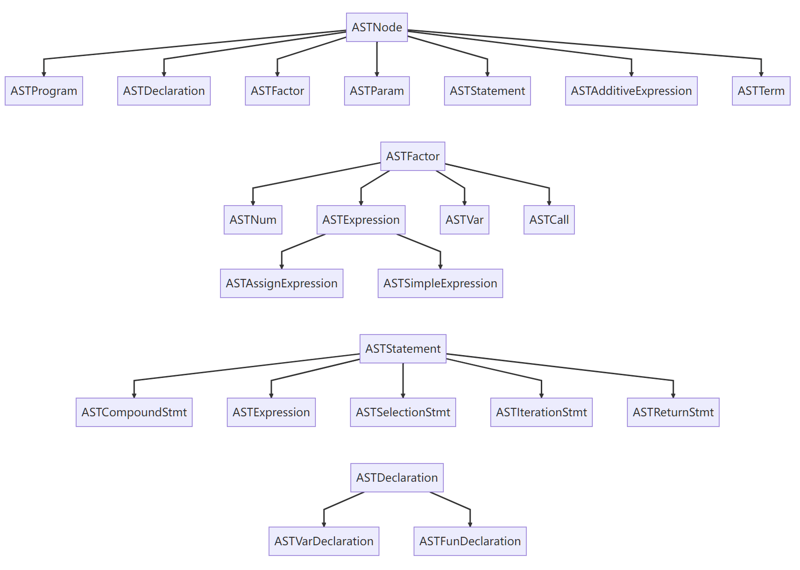
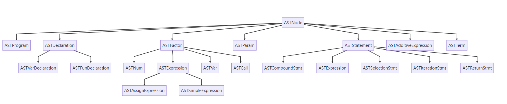

# AST

## 简介

**AST（抽象语法树，Abstract Syntax Tree）** 是编程语言中的一种树状数据结构，用于表示源代码的语法结构。AST 将程序代码中的元素（如变量、运算符、语句等）按照层次结构组织起来，去除掉原始源代码中的一些无关紧要的信息（例如注释和格式），并抽象出表达式和控制流的关键部分。

AST 是编译器用来理解和处理源代码的关键步骤。编译器首先将源代码解析成 AST，然后再进行优化，生成中间代码。

对于 phase1 中 `Bison` 生成的 `syntax_tree` 本身就是 AST，但为了适配 lab2 中通过访问者模式进行中间代码生成的需求，我们在这里需要将其简化，将每个语法树结点类型抽象为一个类，在每个类中填充一些属性，并按类进行中间代码生成。

而我们目前得到的 `syntax_tree` 的所有结点都只是由一个 `name` 表示，因此需要将 Bison 自动生成分析树转化成更简单的 AST。

!!! notes "分析树（Parse Tree）与抽象语法树（Abstract Syntax Tree）"

    分析树在语法分析的过程中被构造；抽象语法树则是分析树的浓缩表示，使用运算符作为根结点和内部结点，并使用操作数作为子结点。进一步了解可以阅读 [分析树和抽象语法树的比较](https://stackoverflow.com/questions/5026517/whats-the-difference-between-parse-trees-and-abstract-syntax-trees-asts)。

## 转换示例

比如，我们有如下样例：

```c++
int main(void) { return 0; }
```

经过阶段一中 Flex + Bison 自动构建的词法、语法分析器后，我们得到了一棵 `syntax_tree` 并打印得到：

```
>--+ program
|  >--+ declaration-list
|  |  >--+ declaration
|  |  |  >--+ fun-declaration
|  |  |  |  >--+ type-specifier
|  |  |  |  |  >--* int
|  |  |  |  >--* main
|  |  |  |  >--* (
|  |  |  |  >--+ params
|  |  |  |  |  >--* void
|  |  |  |  >--* )
|  |  |  |  >--+ compound-stmt
|  |  |  |  |  >--* {
|  |  |  |  |  >--+ local-declarations
|  |  |  |  |  |  >--* epsilon
|  |  |  |  |  >--+ statement-list
|  |  |  |  |  |  >--+ statement-list
|  |  |  |  |  |  |  >--* epsilon
|  |  |  |  |  |  >--+ statement
|  |  |  |  |  |  |  >--+ return-stmt
|  |  |  |  |  |  |  |  >--* return
|  |  |  |  |  |  |  |  >--+ expression
|  |  |  |  |  |  |  |  |  >--+ simple-expression
|  |  |  |  |  |  |  |  |  |  >--+ additive-expression
|  |  |  |  |  |  |  |  |  |  |  >--+ term
|  |  |  |  |  |  |  |  |  |  |  |  >--+ factor
|  |  |  |  |  |  |  |  |  |  |  |  |  >--+ integer
|  |  |  |  |  |  |  |  |  |  |  |  |  |  >--* 0
|  |  |  |  |  |  |  |  >--* ;
|  |  |  |  |  >--* }
```

转换为 AST 再打印，我们将得到：

```
program
--fun-declaration: main
----compound-stmt
------return-stmt
--------simple-expression
----------additive-expression
------------term
--------------num (int): 0
```

> 这两个不同语法树的输出都是直接将语法树结点名字按 DFS 的顺序做输出，可以发现后者的结点数量明显更少。在后面的结点类属性分析中，我们可以发现每个结点的信息更丰富。

## 如何转换？

整体的转换逻辑是将一棵 `syntax_tree` 按 DFS 的顺序遍历所有结点，将 `syntax_tree` 的不同结点转化为作用相似的 `ASTNode`。

### `syntax_tree`定义

```c++
struct _syntax_tree_node {
	struct _syntax_tree_node * parent;
	struct _syntax_tree_node * children[10];
	int children_num;

	char name[SYNTAX_TREE_NODE_NAME_MAX];
};
typedef struct _syntax_tree_node syntax_tree_node;
struct _syntax_tree {
	syntax_tree_node * root;
};
typedef struct _syntax_tree syntax_tree;
```

- `syntax_tree` 结构体唯一属性是 `root`，指向根结点的指针
- 每个 `syntax_tree_node` 有以下属性：
  - `parent`：父结点
  - `children`：子结点数组，这里子结点数目是由产生式决定的，不会超过 10
  - `children_num`：子结点的数目
  - `name`：`syntax_tree`结点的名字，也是区分不同结点的标识

比如对于 `declaration-list` 这个结点，其对应的文法产生式为：

$program\rightarrow declaration-list$

$declaration-list \rightarrow declaration-list ~declaration |declaration$

当采用前一个产生式时，我们可以得到以下属性：

- `parent`：`program` 结点的指针
- `children[10]`：`children[0]` 为指向 `declaration-list` 结点的指针，`children[1]` 为指向 `declaration` 结点的指针
- `children_num = 2`
- `name = "declaration-list"`

第二个产生式同理。

### AST 类定义

`Class AST` 定义如下：

```c++
class AST {
	public:
		AST() = delete;
		AST(syntax_tree *);
		AST(AST &&tree) {
				root = tree.root;
				tree.root = nullptr;
		};
		ASTProgram *get_root() { return root.get(); }
		void run_visitor(ASTVisitor &visitor);

	private:
		ASTNode *transform_node_iter(syntax_tree_node *);
		std::shared_ptr<ASTProgram> root = nullptr;
};
```

其中，

- `root` 是 AST 的根结点。

- `transform_node_iter` 即 DFS 遍历函数，将一棵 `syntax_tree` 转换为 `AST`。

- 这里的 `run_visitor` 是访问者模式遍历 `AST` 并输出的接口，本次实验测试会用到，但是实现时不会用到，感兴趣的同学可以研究一下。

  > 我们会在下一个 lab 中详细介绍访问者模式，本次实验不会涉及。

`Class AST` 的构造对象实现在 `src/common/ast.cpp` 中：

```c++
AST::AST(syntax_tree *s) {
	if (s == nullptr) {
		std::cerr << "empty input tree!" << std::endl;
		std::abort();
	}
	auto node = transform_node_iter(s->root);
	del_syntax_tree(s);
	root = std::shared_ptr<ASTProgram>(static_cast<ASTProgram *>(node));
}
```

其中，

- 我们将一个 `syntax_tree` 实例传给构造函数作为参数。
- 我们从 `syntax_tree` 的根结点开始进行 DFS，并将这个新的 `AST` 的根赋给 `AST` 实例的 `root`。
- 转换结束会删除原先的 `syntax_tree`，并释放内存空间。

### `transform_node_iter`函数

本次实验最主要的就是补全 `transform_node_iter` 这个函数的内容。我们将以一个具体的结点例子介绍 `transform_node_iter` 函数的逻辑。

```c++
ASTNode *AST::transform_node_iter(syntax_tree_node *n) {
	if (_STR_EQ(n->name, "program")) {
		auto node = new ASTProgram();
		// flatten declaration list
		std::stack<syntax_tree_node *>
				s;
		auto list_ptr = n->children[0];
		while (list_ptr->children_num == 2) {
			s.push(list_ptr->children[1]);
			list_ptr = list_ptr->children[0];
		}
		s.push(list_ptr->children[0]);

		while (!s.empty()) {
			auto child_node =
					static_cast<ASTDeclaration *>(transform_node_iter(s.top()));

			auto child_node_shared = std::shared_ptr<ASTDeclaration>(child_node);
			node->declarations.push_back(child_node_shared);
			s.pop();
		}
		return node;
	} else if (_STR_EQ(n->name, "declaration")) {
		return transform_node_iter(n->children[0]);
	}
```

对于 `syntax_tree` 的结点 program（也即其根结点），对应的文法产生式为：

```
program -> declaration-list
declaration-list -> declaration-list declaration | declaration
```

我们要将其转换为 `ASTNode` 中的 `ASTProgram`：

```c++
struct ASTProgram : ASTNode {
	virtual void accept(ASTVisitor &) override final;
	virtual ~ASTProgram() = default;
	std::vector<std::shared_ptr<ASTDeclaration>> declarations;
};
```

由其结构体信息，我们需要在转换时填充这个结点的 `declarations` 属性，也就是对应文法产生式的 `declaration-list`。这是一个 `vector` 数组，每一个元素都是一个 `ASTDeclaration`，也就对应着上述第二个产生式的一个 `declaration`。

我们这个结点的转换过程中需要将原先 `syntax_tree` 中的 `declaration-list` 展开，然后对每个 `declaration` 做 DFS。

> 同学们可以思考这里 flatten declaration list 的逻辑，为什么要用 stack。是否可以用其他的 STL 中的数据结构，实现上会有什么区别？
>
> flatten 这个操作也大量出现在本次实验中。

填充完成 `declarations` 后，返回这个结点 node。

## AST 结点

AST 结点类如下：

```c++
struct ASTNode;
struct ASTProgram;
struct ASTDeclaration;
struct ASTNum;
struct ASTVarDeclaration;
struct ASTFunDeclaration;
struct ASTParam;

struct ASTCompoundStmt;
struct ASTStatement;
struct ASTExpressionStmt;
struct ASTSelectionStmt;
struct ASTIterationStmt;
struct ASTReturnStmt;
struct ASTFactor;
struct ASTExpression;
struct ASTVar;
struct ASTAssignExpression;
struct ASTSimpleExpression;
struct ASTAdditiveExpression;
struct ASTTerm;
struct ASTCall;
```

所有类的属性定义在 `include/common/ast.hpp`中。

`ASTNode` 是一个基类，关于基类及其派生类的相关知识已经在 [lab0 C++ 简介 ](../lab0/cpp.md) 有所介绍，这里不做赘述。

结点之间的继承关系如下图：





### ASTNode

```c++
struct ASTNode {
	virtual void accept(ASTVisitor &) = 0;
	virtual ~ASTNode() = default;
};
```

`ASTNode`是所有 AST 结点类的基类，使用默认的析构函数。

其中，`accept` 函数是一个通过访问者模式访问 `AST` 每个结点输出相关信息的接口。

这个函数需要一个 `ASTVisitor` 实例，通过调用 `ASTVisitor` 自身的 `visit` 接口访问该结点。

> 对不同 AST 结点类的 `visit` 函数不同，相关接口可以在 `src/common/ast.cpp` 中查看，本次实验不需要修改。

### 一个 AST 结点类的例子

`ASTVarDeclaration` 类

```c++
struct ASTVarDeclaration : ASTDeclaration {
	virtual void accept(ASTVisitor &) override final;
	std::shared_ptr<ASTNum> num;
};
```

这个类继承自 `ASTDeclaration`。

会有如下三个属性：

- `type`：变量声明的类型 (type-specifier)
- `id`：变量名 (ID)
- `num`：数组类型变量的下标 (INTEGER)

这些属性与文法产生式对应，比如这个类对应的文法产生式为：

$\text{var-declaration}\ \rightarrow \text{type-specifier}\ \underline{\textbf{ID}}\ \underline{\textbf{;}}\ |\ \text{type-specifier}\ \underline{\textbf{ID}}\ \underline{\textbf{[}}\ \underline{\textbf{INTEGER}}\ \underline{\textbf{]}}\ \underline{\textbf{;}}$

其他类定义类似，都可以在 `include/common/ast.hpp` 中找到。
