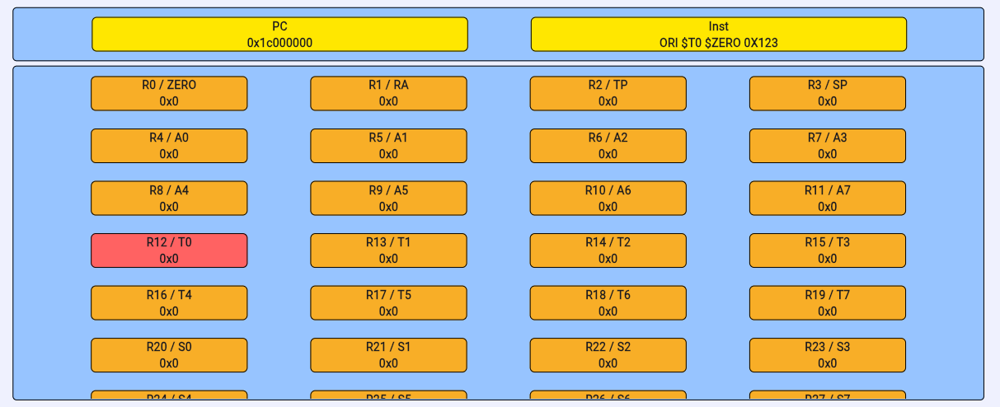
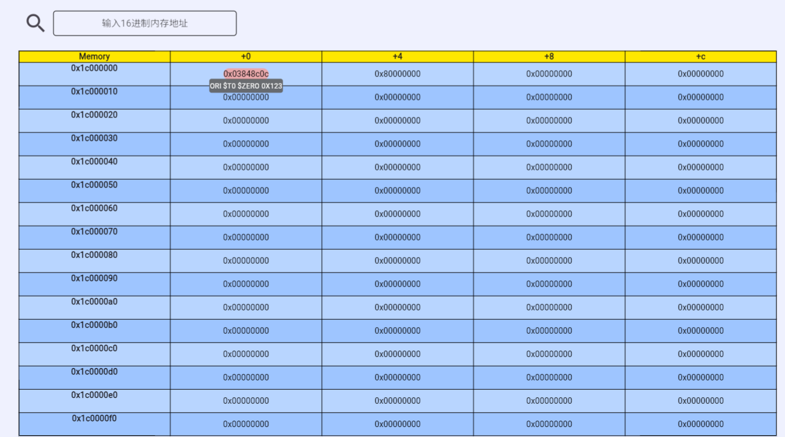

# <strong>LARS</strong>

!!! Note "LA32R 指令集专属"

    LARS 为 LA32R 指令集的相关工具，选择 RV32I 的同学请移步 RARS。

LARS（Loongarch32R Assembler and Runtime Simulator）是一个龙芯 32 位精简指令集架构（Loongarch32R）的汇编器和运行时模拟器，由中国科学技术大学计算机科学与技术学院本科生课程《计算机组成原理》的课程设计项目组原创开发。使用链接在[这里](https://jyjsxx.github.io/)。


## <strong>项目简介</strong>

LARS 项目的目标是实现一个能够将 Loongarch32R 汇编代码转换为机器码的汇编器，并提供一个能够模拟 Loongarch32R 指令集架构的运行时模拟器。LARS 项目的主要功能包括：

- 支持 Loongarch32R 指令集架构的汇编器，能够将 Loongarch32R 汇编代码转换为机器码；

- 支持 Loongarch32R 指令集架构的运行时模拟器，能够模拟 Loongarch32R 指令集架构的指令执行过程；

- 支持 Loongarch32R 指令集架构的汇编代码的调试功能，能够在汇编代码中设置断点、单步执行、查看寄存器和内存等。

!!! Success "LARS 开发团队"

    - 前端视觉设计
        - 刘睿博（2021 级计算机科学与技术学院）
        - 马子睿（2020 级计算机科学与技术学院）
        - 杨映川（2022 级计算机科学与技术学院）

    - 后端开发
        - 刘睿博（2021 级计算机科学与技术学院）
        - 马子睿（2020 级计算机科学与技术学院）
  
    （排名不分先后，按姓名拼音首字母排序）


## <strong>代码编写</strong>

下面，我们将以一段简单的汇编程序为例，介绍如何使用本工具。这段汇编程序是将内存中的数据复制到另一个内存地址中。

```assembly
.data
a:
.word 8

.text
la.local $r1, a
ld.w $r2, $r1, 0
addi.w $r1, $r1, 4
st.w $r2, $r1, 0
```

在界面左侧的文本框中，您可以随心所欲地编写代码：

## <strong>代码编译</strong>

??? Tip "编译按钮"
    
    这是编译按钮
	

当您编写完代码后，点击界面左侧的“编译”按钮，即可将您的代码编译为机器码：

- 代码（.text）段的数据将会顺序放置在以`0x1c000000`为起始地址的内存中
- 数据（.data）段的数据将会顺序放置在以`0x1c800000`为起始地址的内存中。

## <strong>代码运行</strong>

??? Tip "运行相关按钮"

	这是运行按钮
	
	
	这是单步执行按钮
	
	
	这是单步回退按钮
	

当您编译代码后，点击“单步执行”、“运行”、“单步回退”按钮，即可调试程序

LARS支持断点，将会在后面的内存监视器部分介绍

## <strong>寄存器状态</strong>

在LARS的右上部分，我们给出了当前寄存器和PC值。当寄存器变化时它会被以红色高亮显示。



## <strong>内存监视器及断点</strong>

您可以通过在搜索框中输入地址的十六进制值再点击左侧的🔍按钮 监视内存

您可以通过悬浮的方式获取反汇编代码

您可以通过点击内存单元的方式打断点



## <strong>导出 COE 文件</strong>

??? Tip "导出代码相关按钮"

	这是导出代码段的COE文件
	

	这是导出数据段的COE文件
	

## <strong>异常处理</strong>

当您的代码出现可以预料到的错误时，会有弹窗显示错误信息；

当您的代码出现未知的错误时，会表现为 **操作无响应** ，当出现这种情况时，请与助教联系