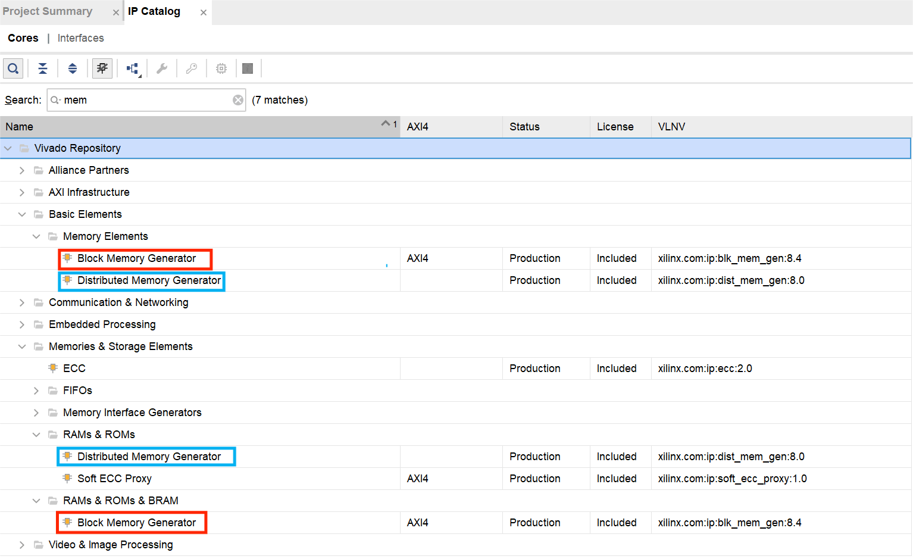
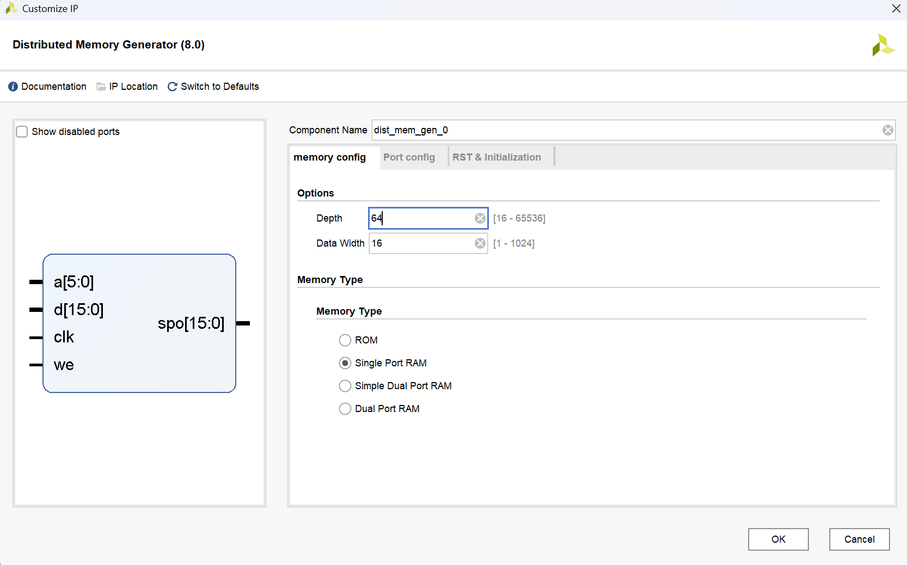

# <strong>IP 核使用</strong>

## <strong>概述</strong>

Intellectual Property (IP) core 是一种在数字设计中广泛使用的概念，它代表了可重用的、独立的数字电路模块，通常是经过验证和优化的。IP 核的目的是通过提供通用和标准的功能块，使数字设计变得更加模块化、易于维护，并加速设计流程。

相较于传统的模块，IP 核具有以下的特点：

- 可重用性：IP 核是可重用的，可以在多个项目和设计中使用。这有助于提高设计的效率，减少重复工作。
- 独立性：IP 核通常是独立的功能块，与其他 IP 核和系统的其他部分解耦。这使得它们更容易测试、验证和维护。
- 标准接口：IP 核通常使用标准接口与其他模块进行通信，例如 AXI（Advanced eXtensible Interface）总线协议。这种标准化有助于在不同的设计中更轻松地集成 IP 核。
- 充分验证：大多数 IP 核都经过了充分的验证，设计者可以相对放心地在他们的项目中使用这些 IP 核，而无需重新验证其功能。
- 定制性：一些 IP 核允许用户进行一定程度的定制，以适应特定的设计需求。这种定制性可以通过参数配置或其他手段实现。

<figure markdown>
{ width="500" }
</figure>

Vivado 中内置了许多常用的 IP 核，其中包括：

- 处理器系统 IP：Vivado 提供了各种处理器系统 IP，包括 MicroBlaze™ 微处理器和 Zynq® UltraScale+™ MPSoC 等。这些 IP 核允许设计者在 FPGA 或 SoC 中集成处理器，实现软硬件协同设计。

- 逻辑和算术 IP：Vivado 包含了一系列的逻辑和算术 IP 核，例如：
    - 常见逻辑门：AND、OR、XOR 等。
    - 多输入逻辑：LUT（查找表）等。
    - 算术运算：加法器、减法器、乘法器等。

- 通信和存储 IP：Vivado 提供了用于通信和存储的 IP 核，例如：
    - DDR 控制器：用于连接外部 DDR 存储器。
    - PCI Express 控制器：用于实现 PCI Express 接口。
    - 以太网控制器：用于实现以太网通信。

- 视频和图像处理 IP：Vivado 包含一些用于视频和图像处理的 IP 核，例如：
    - 视频输入输出（VIO）：用于处理视频输入和输出。
    - 视频处理器：用于图像缩放、滤波等处理。

- 数字信号处理（DSP）IP：Vivado 提供了用于数字信号处理的 IP 核，例如：

    - FIR 和 IIR 滤波器：用于数字信号滤波。
    - FFT：用于快速傅立叶变换。

- 系统管理 IP：Vivado 还提供了一些用于系统管理的 IP 核，例如：
    - 系统监视器：用于监视系统性能和资源利用率。
    - 时钟管理器：用于生成和管理时钟信号。

上述这些 IP 核可通过 Vivado 的图形用户界面（GUI）或命令行界面（Tcl shell）进行配置和集成。设计者可以根据他们的特定需求选择并集成这些 IP 核，从而加速数字系统的设计过程。

下面，我们将对其中的两种进行介绍：时钟 IP 核，以及存储器 IP 核。


## <strong>存储器 IP 核</strong>

Vivado 提供了两种存储器：分布式存储器与块式存储器。我们同样打开 Vivado 进入项目界面。点击 IP catalog，在弹出的窗口中搜索 Distributed Memory Generator（分布式存储器）或 Block Memory Generator（块式存储器）即可找到。你也可以直接搜索 mem，按照下图所示的方法找到这两个 IP 核。

<figure markdown>
{ width="700" }
</figure>

分布式存储器是分布在 FPGA 的逻辑资源中的小规模存储器单元。每个存储器单元通常包含数十到数百个存储位。存储在分布式存储器中的数据与逻辑电路共享同一片 FPGA 芯片的 LUTs（查找表）。分布式存储器通常用于存储较小规模的数据，如局部变量、中间结果等。

块存储器是 FPGA 中的硬件块，通常拥有更大的存储容量和更高的带宽。存储在块存储器中的数据是专用的，不与逻辑电路共享 LUTs。块存储器可以看作是 FPGA 中的硬件内存块，适用于存储大量的数据。

简单起见，我们建议大家优先使用分布式存储器。下面我们以分布式存储器为例介绍相关的细节。

<figure markdown>
{ width="700" }
</figure>

memory config 一栏定义了存储器的基本信息。

- Options 中 Depth 参数定义了存储单元的个数，Data Width 定义了每个存储单元的 bit 数。例如，上图中所示的参数定义了一个 $64\times16$ bits 大小的存储器。左侧的缩略图中地址信号 `a` 的位宽为 $\log_264=6$，写入数据信号 `d` 和读出数据信号 `spo` 的位宽均为 16。
- Memory Type 一栏定义了存储器的类型。支持的四种类型包括：
    - ROM：只读存储器。仅包含地址端口 `a` 和读出数据端口 `spo`，本质上就是一个大型查找表 LUT。
    - Single Port RAM：单端口存储器。读写使用相同地址，依据写使能信号 `we` 是否有效进行区分。
    - Simple Dual Port RAM：简单双端口存储器。读取使用专门的地址 `dpra` 和读出数据 `dpo`，写入使用专门的地址 `a` 和 `d`。两组端口之间互不干扰。
    - Dual Port RAM：真正双端口存储器。与简单双端口存储器的不同在于，`a` 端口是可读可写的，根据 `we` 信号进行区分，该端口的读出数据从 `spo` 端口输出。`dpra` 依然是只读端口，二者互不干扰。


Port config 界面对于存储器的输入和输出端口进行了更为细致的设置。此处请全部选择 Non Registered，感兴趣的同学可以自行探索其他选项的意义。
 
RST & Initialization 界面定义了存储器的初始化信息。IP 核使用一种特定的文件：COE 文件进行初始化。该文件的介绍如下：

```
; Sample Initialization file for a 32x16 distributed ROM （注释行）
memory_initialization_radix = 16;
memory_initialization_vector =
23f4 0721 11ff ABe1 0001 1 0A 0
23f4 0721 11ff ABe1 0001 1 0A 0
23f4 721 11ff ABe1 0001 1 A 0
23f4 721 11ff ABe1 0001 1 A 0;
```

第一行为注释，表明这是一个 $32\times16$ bits 的存储器。`memory_initialization_radix` 指定了输入数据为 16 进制表示。`memory_initialization_vector` 指定了存储器每一个存储单元的初始数值。例如，`MEM[0] = 16'H23f4`，`mem[1] = 16'H0721`，`mem[6] = 16'H000a`。COE 文件使用逗号、空格或换行符分隔每一个数据，数据是按顺序写入的，最后以分号作为结尾。

完成 IP 核的设置后，便可以单击 `OK` 生成 IP 核了。对于生成好的 IP 核，可以从 .veo 文件中查看例化所需要的端口信息，之后就可以像普通模块一样在项目中例化 IP 核。

<figure markdown>
{ width="500" }
</figure>