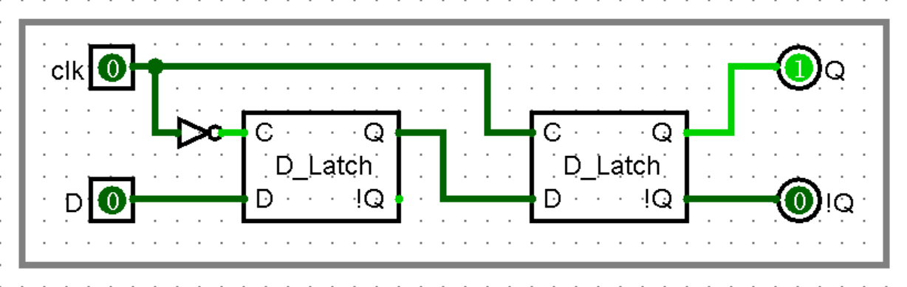
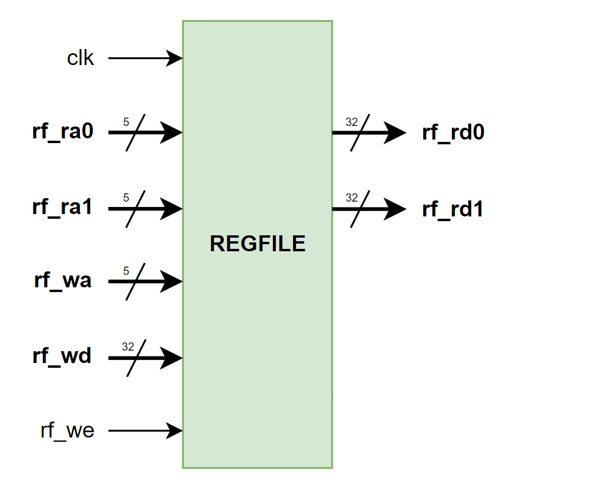

# <strong>寄存器堆</strong>


## <strong>寄存器</strong>

寄存器是十分基础的时序逻辑元件。在「数字电路实验」中我们提到：可以通过 D 锁存器搭建一个基础的 D 触发器单元。

??? "什么是 D 锁存器？"

    请参考[数字电路实验教程](https://soc.ustc.edu.cn/Digital/lab5/sequential/#11)中的相关介绍。


<figure markdown>
{ width="550" }
<figcaption>D 触发器</figcaption>
</figure>

如上图所示，我们将两个 D 锁存器级联，并加入一个非门，就得到了 D 触发器（D flip flop）。这里我们让控制信号以一定的周期进行高低电平翻转，类似于一个时钟 Clock 信号，因此记作 clk。电路的分析如下：

- 当 clk 为低电平时，前一个锁存器处于更新状态，此时 D 端输入可以直接写入前一个锁存器。后一个锁存器处于保持状态，无论前一个锁存器输出如何，后一个锁存器均保持自身原先的数值不变。

- 当 clk 为高电平时，前一个锁存器处于保存状态，此时 D 端输入无法写入前一个锁存器。后一个锁存器处于更新状态，将会写入前一个锁存器的值。这个时候毛刺信号均无法影响到后一个锁存器，因而增强了电路的稳定性。

通过非门，两个 D 锁存器的时钟存在一个 180° 的相位差（也就是是相差半个时钟周期），从而实现：只在时钟上升沿的时候读取输入并输出，其他时候输入的变化不会传导到输出端。

上面的 Logisim 电路与下面的 Verilog 代码对应：

```verilog linenums="1" title="D 触发器"
always @(posedge clk) begin
    Q <= D;
end
```

为了更好地控制触发器的行为，我们可以为 D 触发器增加使能端 enable，得到门控的 D 触发器。

<figure markdown>
{ width="550" }
<figcaption>门控 D 触发器</figcaption>
</figure>

如上图所示。当 enable 信号为 0 时，电路将持续写入内部保存的数值，不会被外界输入 D 更新。这就是一个最为基本的寄存器单元，与之对应的 Verilog 代码如下：

```verilog linenums="1" title="门控 D 触发器"
always @(posedge clk) begin
    if (enable)
        Q <= D;
    else
        Q <= Q;
end
```

在实际的应用中，寄存器往往会有一个使能端口和复位端口，以便用户更好地控制寄存器的行为。


## <strong>寄存器堆</strong>

上面介绍的寄存器仅能存储 1 位的数据。为了提高其存储容量，我们可以将多个寄存器拼接起来，组成一个大的寄存器阵列，这就得到了寄存器堆。

寄存器堆是 CPU 中的临时数据存储单元。在我们的 CPU 中，寄存器堆有 1 个写端口，2 个读端口。本次实验中，寄存器堆的大小为 $32\times32$ 比特，也就是包含 32 个位宽为 32 比特的寄存器的阵列。

下面是寄存器堆模块的示意图：

<figure markdown>
{ width="400" }
<figcaption>寄存器堆示意图</figcaption>
</figure>

其中，rf_ra0 - rf_rd0、rf_ra1 - rf_rd1 为数据读取端口；rf_wd - rf_wa 为数据写入端口；rf_we 为写使能信号。

为了帮助大家更好地理解寄存器堆的作用，我们为大家提供了一个基础的寄存器堆代码。

```verilog  linenums="1"  title="寄存器堆"
module REG_FILE (
    input                   [ 0 : 0]        clk,

    input                   [ 4 : 0]        rf_ra0,
    input                   [ 4 : 0]        rf_ra1,   
    input                   [ 4 : 0]        rf_wa,
    input                   [ 0 : 0]        rf_we,
    input                   [31 : 0]        rf_wd,

    output                  [31 : 0]        rf_rd0,
    output                  [31 : 0]        rf_rd1
);

    reg [31 : 0] reg_file [0 : 31];

    // 用于初始化寄存器
    integer i;
    initial begin
        for (i = 0; i < 32; i = i + 1)
            reg_file[i] = 0;
    end

    always @(posedge clk) begin
        reg_file[rf_wa] <= rf_wd;
    end

endmodule
```

为了支持 LA32R 和 RV32I 指令集，上面的代码需要做出如下改动：

- 0 号寄存器始终为 0，永远无法被更改；
- 时钟上升沿到来时，如果写使能信号有效，则进行写入操作，否则不进行写入操作；
- 寄存器堆的读操作是时钟异步的（实际上是组合逻辑），即只要地址给定，对应寄存器的数值就能读出，而无需等待时钟边沿的到来。

!!! Warning "写优先"

    如果你曾经写过「写优先」的寄存器堆，请一定要在这里将其删除。单周期 CPU 中引入写优先将会导致组合环。


??? Question "为什么寄存器堆没有复位端口？"

    这是因为我们的 CPU 并没有对寄存器进行复位的功能需求。用户在编写汇编程序时，除了 0 号寄存器始终为 0 之外，不应当假定任何寄存器具有固定的初始值。因此，我们在实现 CPU 时，也取消了寄存器堆的复位端口信号。


