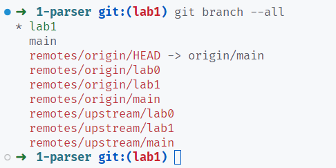
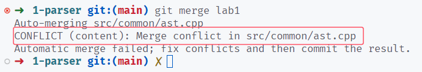
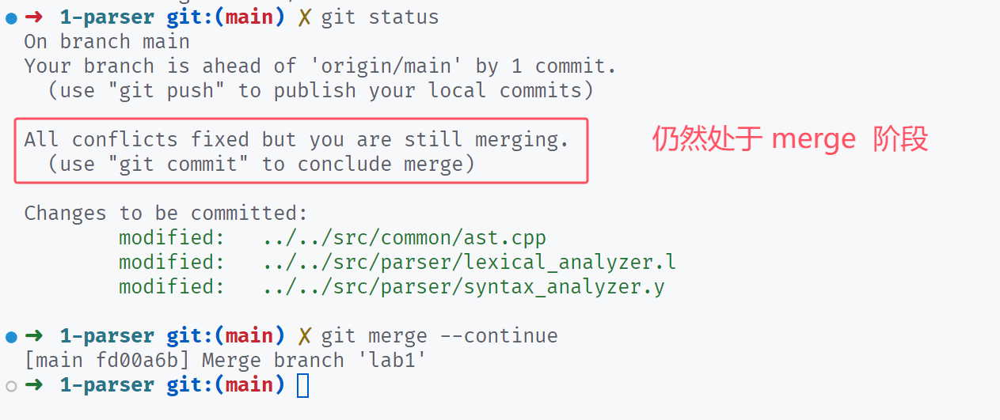
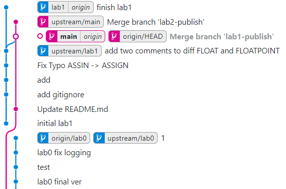

<!-- TODO:
1）确定 deadline
2）优化文档关于 Light IR C++ api 介绍的内容
3）说明 git 仓库同步的流程，如何 merge
4）在 warmup 阶段，有一些例子引用了仓库链接，需要同步仓库后更新这些链接！
5）Lab1 也有 AST，需要检查 lab2 关于 AST 的叙述是不是要改动

 -->

# Lab2 中间代码生成

本次实验需要同学们在 Lab1 实现的 Cminusf 解析器基础上，完成从语法树向中间代码的自动化翻译过程。

## 实验内容

本次实验需要分阶段完成及验收。

### 阶段一

- 内容一：
  阅读 [Light IR 预热](./warmup.md)并参考 [Light IR 手册](./LightIR.md) 和 [Light IR C++ 库](./LightIR C++.md)，掌握手写 Light IR，使用 Light IR C++ 库生成 IR 的方法。
- 内容二：
  阅读[访问者模式](./visitor_pattern.md)，理解 C++ 访问者模式的工作原理及遍历顺序。

阶段一需要 **回答 [Light IR 预热](./warmup.md#思考题)与[访问者模式](./visitor_pattern.md#思考题)文档中的思考题**，回答内容保存为 `answer.pdf`。并完成 `tests/2-ir-gen/warmup/stu_ll` 与 `tests/2-ir-gen/warmup/stu_cpp` 目录下代码的编写。

!!! warning "Deadline"

    **2024 年 10 月 18 日 23:59**

### 阶段二

阅读 [IR 自动化生成](./autogen.md)，[Cminusf 语义](./cminusf语义.md)，补充 `include/cminusfc/cminusf_builder.hpp` 与 `src/cminusfc/cminusf_builder.cpp` 文件，并通过 `tests/2-ir-gen/autogen/testcases/`目录下 `lv0_1`, `lv0_2`, `lv1` 级别的测试样例。

!!! warning "Deadline"

    **2024 年 10 月 25 日 23:59**

### 阶段三

在阶段二的基础上，继续补充 `include/cminusfc/cminusf_builder.hpp` 与 `src/cminusfc/cminusf_builder.cpp` 文件，并通过 `tests/2-ir-gen/autogen/testcases/` 目录下所有提供的测试样例。

!!! warning "Deadline"

    **2024 年 11 月 2 日 23:59**

## 实验要求

根据 [Lab1 的要求](../lab1/index.md#实验要求)，学生有两个远程仓库：

- upstream：课程发布实验代码的公开仓库
- origin：学生 fork 得到的私有仓库

两个仓库各有 3 条分支（红色字体）：main、lab0 和 lab1，如下图。最上边的 lab1 和 main 代表本地的分支，分别追踪远程的 `origin/lab1` 和 `origin/main`，main 前边的星号 `*` 和绿色字体代表当前处于 main 分支下：

!!! info
以上两条命令分别是：`git remote -v` 和 `git branch --all -vv`，如果第二条命令的输出中缺少 upstream 的分支，你可以通过 `git fetch --all` 来获取。

在实验一中，我们通过 lab1 分支发布实验，与 lab0 作为区分，因此学生也是处于 lab1 分支下完成实验。从本次实验开始，我们将使用 main 分支发布实验。在开始撰写本次实验代码之前，学生需要抓取最新的 main 分支到本地，然后将 lab1 分支合并到 main 分支，并处理可能的冲突。以下是详细的指导。

### 拉取最新代码

首先切换到 main 分支下：

- `git checkout main`：如果 `git branch` 的输出存在 main
- 或 `git checkout -b main --track origin/main`：如果 `git branch` 的输出不存在 main

然后使用 `git pull upstream main` 获取最新内容。此时你应该可以在项目下找到 `tests/2-ir-gen/**` 和 `src/lightir/**` 等内容。

### 合并 lab1 分支

检查当前关于 lab1 的实验内容：`src/parser/lexical_analyzer.l`、`src/parser/syntax_analyzer.y` 和 `src/common/ast.cpp`，你会发现曾经完成的代码不见了，这三个文件处于 lab1 开始前的版本。现在使用 `git merge lab1`，将你在 lab1 完成的内容合并到主分支（main）下。

??? note "如果你遇到了冲突"
在执行 merge 时，git 会尝试自动合并经过修改的文件内容，如果一处内容同时被两方（current 和 incoming）修改，就会产生冲突，需要手动决定保留哪一方的更改（或者都保留）。

    [回顾 Lab0 中关于 git 冲突处理的讲解](../lab0/git.md#上下游同步和冲突处理)。

    下图就是在合并时出现了冲突的例子，表示在 `src/common/ast.cpp` 文件出现了冲突。
    

    我们检查这个文件，看到一处冲突，截图如下：
    

    在这里，我们（上游仓库）最新的代码将 `ASTVisitor::visit` 接口的返回值更新成了 `Value *`，这种接口变动要以上游为准。现在是将 lab1 合并进 main 分支，所以进行 merge 的双方，current 是上游内容，incoming 是 lab1 的内容，在这里保留 current 内容。

    在完成文件的更改后，保存文件，你仍然在 merge 的阶段，你可以使用 `git status` 查看，并使用 `git merge --continue` 完成你的合并操作，如下图所示。

    

    事实上，在处理本次合并可能的冲突时，只需要保留你在 lab1 编写的代码即可，其余基本上都保留上游仓库的最新内容。

此时进入 build 文件夹，使用 `make -j` 编译最新的程序，然后进入 lab1 的测试目录 `tests/1-parser`，执行 lab1 的两个脚本。在正确合并分支的情况下，你应该能够正常编译项目并通过 lab1 的两个脚本，这时你可以开始本次实验的撰写了。

<!--
然后抓取来自公开仓库（upstream）的最新内容：`git fetch --all`。这时最新内容还保存在 `remotes/upstream/main` 下边，你可以通过一款叫做 `Git Graph` 的 vscode 插件来可视化这些分支的迭代关系，如下图：

同一分支上越靠上的节点，代表越新的更改。这里我们关注红色线，因为这是 master 分支，我们看到 `origin/main` 当前落后于 `upstream/main` 一个提交。我们使用命令 `git merge upstream/main` 将最新的实验内容合并到本地。
-->

## 提交内容

- 阶段一：在希冀平台提交你的 `answer.pdf` 文件，在希冀平台提交你实验仓库的 url（如 `https://cscourse.ustc.edu.cn/vdir/Gitlab/xxx/2024ustc-jianmu-compiler.git`）。
- 阶段二、三：在希冀平台提交你实验仓库的 url（如 `https://cscourse.ustc.edu.cn/vdir/Gitlab/xxx/2024ustc-jianmu-compiler.git`）。
