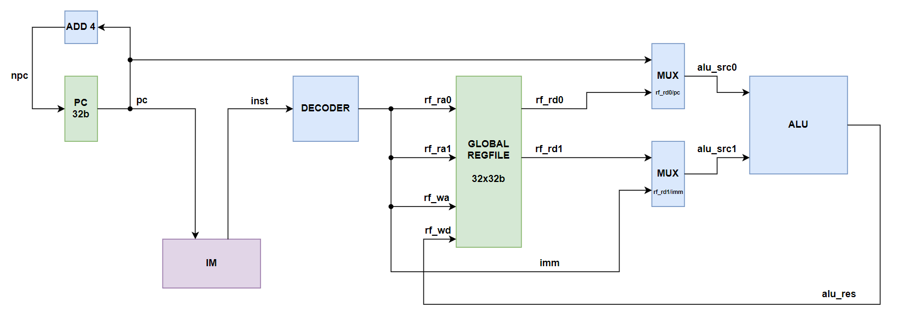

# <strong> 单周期 CPU（简化版）</strong>


## <strong>整体框架</strong>

<figure markdown>
{ width="800" }
<figcaption>CPU 数据通路</figcaption>
</figure>


上图展示了本次实验中 CPU 的数据通路。该数据通路可以兼容 RV32I 版本的 CPU 和 LA32R 版本的 CPU，二者仅在译码器 Decoder 的内部结构上不同。此外，<strong>通路中省略了控制信号，例如 alu_op、rf_we 等。</strong>

## <strong>模块设计</strong>

### <strong>PC 寄存器</strong>

寄存器是我们最先接触的时序元件。一般而言，我们可以用如下的 Verilog 程序描述寄存器的行为：

```verilog  linenums="1"  title="寄存器的 Verilog 实现"
always @(posedge clk) begin
    if (rst)
        q <= 0; 
    else
        q <= d;     // q stores the value inside the register
end
```
上面的代码给出了带有同步复位信号的寄存器单元。其中，q 为当前寄存器中保存的数据，d 为即将写入寄存器的数据。

在 CPU 中，PC 寄存器时刻存储了正在执行的指令的地址。它的功能是将当前指令的地址传递给指令存储器，从而读出此时正确的指令内容。同时，它也需要能够接受下一条指令地址的输入，并在时钟上升沿到来时更新自己的值，从而实现了指令的连续运行。

PC 寄存器的模块示意如下所示：

<figure markdown>
{ width="400" }
<figcaption>PC 模块示意图</figcaption>
</figure>

其端口代码为：

```verilog  linenums="1"  title="PC"
module PC (
    input                   [ 0 : 0]            clk,
    input                   [ 0 : 0]            rst,
    input                   [ 0 : 0]            en,
    input                   [31 : 0]            npc,

    output      reg         [31 : 0]            pc
);
```

??? Question "为什么要有使能信号？"

    在课堂上我们提到过：单周期 CPU 每个时钟周期都会更新 PC 寄存器中的值。因此，寄存器的写入操作应当在每个时钟周期内进行。那么这里为什么依然保留了使能信号呢？

    这是因为我们需要引入来自 PDU 的控制逻辑。试想：虽然单周期 CPU 每个时钟周期都会执行一条指令，但指令的数目是有限的。我们必然需要在合适的时候让 CPU 停下来，从而让我们观察 CPU 的执行情况。因此，PC 寄存器依然需要保留外界的使能信号。


值得一提的是，从代码上看，PC 寄存器的行为可以被一个 always 块完全实现。那么为什么我们还是将其封装成了一个模块呢？

- 一方面，高度模块化的设计可以使我们的电路结构更加清晰，减少杂乱的门电路的出现（看不见就是没有.jpg）。
- 另一方面，我们可以更为直观地看到各个模块之间数据的传输关系，便于和提供的单周期数据通路进行比对。
- 此外，为了代码的可读性，我们一般不会在一个模块中保留过多的代码。

综上所述，对于部分基础模块的封装是很有必要的。


!!! Danger "正确设置 PC 的起始地址！"

    <strong><font color=#FF0000>
    请根据你所使用的指令集合理设置 PC 寄存器的复位值。
    </font></strong>

    在仿真和上板时，我们往往会先置 rst 信号为高电平，将所有的寄存器复位到正确的初始状态，而 LA32R 和 RV32I 指令集对用户程序的起始地址有着不同的规定。

    - 对于 LA32R 指令集，程序段的起始地址位于 0x1C000000。这也对应着 Lars 中 .text 段的起始地址；
    - 对于 RV32I 指令集，程序段的起始地址位于 0x00400000。这也对应着 Rars 中默认类型内存分布下 .text 段的起始地址。
  

### <strong>寄存器堆</strong>

<figure markdown>
{ width="400" }
<figcaption>RF 模块示意图</figcaption>
</figure>

本次实验我们需要在 Lab2 的寄存器堆基础上，为其添加一组 debug 接口 debug_reg_ra、debug_reg_rd。这一对端口与数据读端口功能一致，只用于仿真与上板时的调试。CPU 在正常运行时并不会用到这两个端口。


### <strong>数据选择器</strong>

<figure markdown>
{ width="400" }
<figcaption>选择器模块示意图</figcaption>
</figure>

ALU 的两个源操作数可能是寄存器堆的输出，也可能是立即数，还可能是当前 PC 的值。为此，我们需要为源操作数添加数据选择器，用于控制 ALU 的数据来源。一个简单的参数化选择器实现如下：

```verilog linenums="1" title="二选一选择器"
module MUX1 # (
    parameter               WIDTH                   = 32
)(
    input                   [WIDTH-1 : 0]           src0, src1,
    input                   [      0 : 0]           sel,

    output                  [WIDTH-1 : 0]           res
);

    assign res = sel ? src1 : src0;

endmodule
```

对于 LA32R 和 RV32I 指令集来说，ALU 的数据来源为：

- alu_src0：可能来自 PC，可能来自寄存器堆；
- alu_src1：可能来自立即数，可能来自寄存器堆。


### <strong>译码器</strong>

译码器是 CPU 的心脏，它负责根据输入的指令生成相应的控制与数据信号。下面是本次实验中译码器的结构示意图。

<figure markdown>
{ width="400" }
<figcaption>译码器模块示意图</figcaption>
</figure>

其端口代码为：

```verilog  linenums="1"  title="译码器"
module DECODE (
    input                   [31 : 0]            inst,

    output                  [ 4 : 0]            alu_op,
    output                  [31 : 0]            imm,

    output                  [ 4 : 0]            rf_ra0,
    output                  [ 4 : 0]            rf_ra1,
    output                  [ 4 : 0]            rf_wa,
    output                  [ 0 : 0]            rf_we,

    output                  [ 0 : 0]            alu_src0_sel,
    output                  [ 0 : 0]            alu_src1_sel
);
```

各个输出端口的作用是：

- alu_op：ALU 的运算模式码；
- imm：经过扩展的立即数；
- rf_ra0、rf_ra1：寄存器堆的读地址；
- rf_wa：寄存器堆的写地址；
- rf_we：寄存器堆的写使能；
- alu_src0_sel、alu_src1_sel：ALU 的源操作数选择信号。

译码器模块为一个巨大的组合逻辑单元，所有的信号都根据 inst 的数值，结合对应指令集的译码规则得出。需要指出的是：rf_ra0、rf_ra1 和 rf_wa 三条信号较为特殊，因为其在指令中的位置是固定的，可以直接通过截取得到；其他信号则需要判断指令的类型后，通过更为复杂的逻辑得到。

!!! Danger "译码器"

    <strong><font color=#FF0000>
    请根据你所使用的指令集实现译码器的功能。
    </font></strong>

    由于指令集不同，因此每条指令的译码规则也不同。请根据 Lab1 中我们需要实现指令，查阅对应的指令集手册，以正确生成译码器模块的输出信号。


??? Question "一条指令没有这个信号该怎么办？"

    这是一个很好的问题。以下面两条 LA32R 指令为例：

    - 算数立即数右移：srai.w rd, rj, imm（RISC-V 中为 srai rd, rs1, shamt）
    - 算数右移：sra.w rd, rj, rk（RISC-V 中为 sra rd, rs1, rs2）

    srai.w 指令并没有 rk 字段，因此也就不需要译码器的 rf_ra1 端口。我们自然可以让此时 rf_ra1 的输出为 0，也可以按照相同的逻辑读取指令对应部分的值（尽管此时该字段为立即数），只需要保证后续送入 ALU 的源操作数是正确的即可。

    同理，对于 sra.w 指令，译码器的 imm 端口可以是任意的数值，只需要保证后续送入 ALU 的源操作数是正确的即可。


