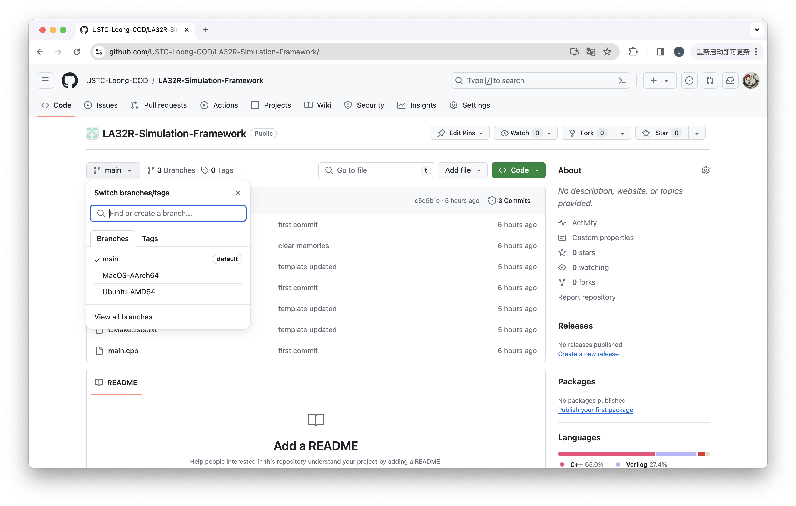
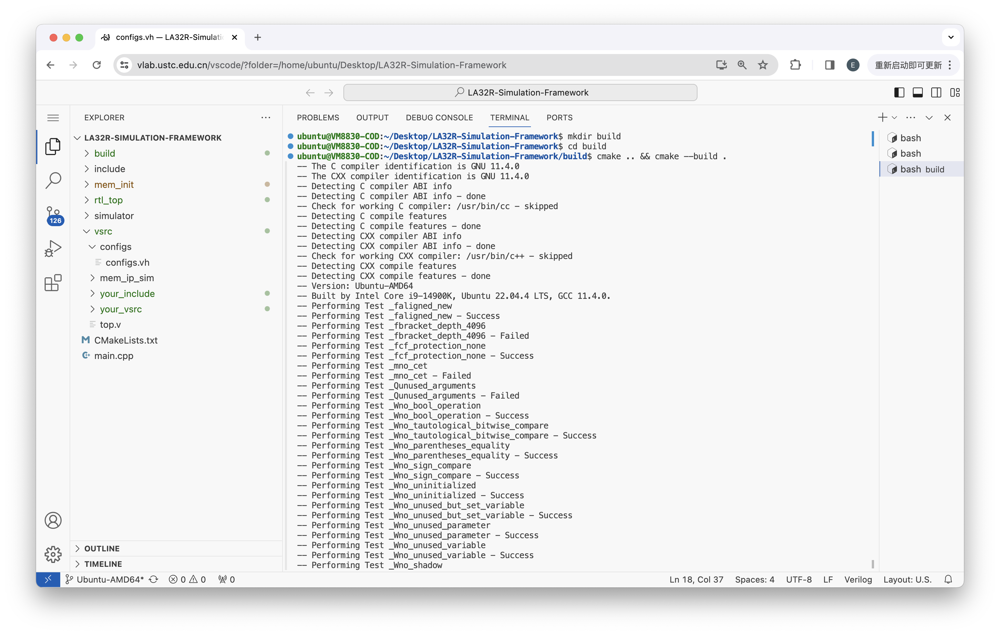
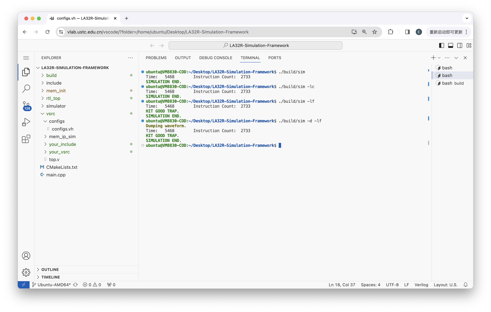
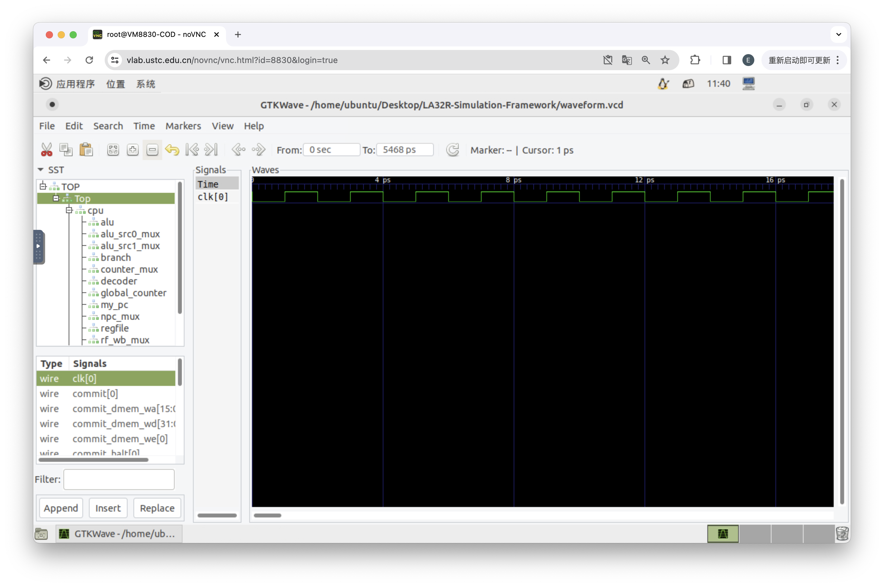

# **LA32R 仿真框架使用手册**

!!! Warning "LA32R 特供"

    **本仿真框架为 LA32R 指令集所定制，选择 RISC-V 指令集的同学仍需自行编写仿真激励文件并使用 Vivado 进行仿真。**

!!! Note "Difftest"

    本仿真框架旨在于提供 Difftest 功能。对于 Difftest，你可以理解为，我们使用一个参考 CPU 与你实现的 CPU 进行对比，一旦两者不一致，我们就输出错误信息并停止仿真。

## **使用步骤**

!!! Note "发行版"

    本实验框架目前有 Ubuntu-AMD64 和 MacOS-AArch64 两个平台的发行版，Windows 平台的发行版将不会被提供。

    各发行版的详细信息会在 CMake 命令执行的时候输出。如需其它架构的发行版，请联系助教。

我们以 Ubuntu-AMD64 发行版为例介绍本仿真框架的使用。对于其它的发行版，操作步骤是类似的。


#### **1. 安装依赖项**

本仿真框架所需要的依赖项包括 Git, CMake 和 Verilator。对于 Git 和 CMake，你可以简单地使用 APT 安装：

``` shell
$ sudo apt install git cmake
```

对于 Verilator，由于 APT 提供的版本较旧，你需要参照[我们的这篇文档](https://soc.ustc.edu.cn/CECS/lab0/verilator/)手动编译安装。

!!! Note "建议使用 Vlab 虚拟机"

    你可能已经在 Verilator 安装的教程页面看到了“Vlab 虚拟机已部署此工具”的提示框。使用 Vlab 虚拟机可以省去自行手动编译安装 Verilator 的过程。

    你可以[点此跳转](https://vlab.ustc.edu.cn/)至 Vlab 页面。

#### **2. 获取实验框架**

本实验框架存放在 GitHub 仓库 `https://github.com/USTC-Loong-COD/LA32R-Simulation-Framework/` 中，**你需要选择合适的分支进行克隆**。

<figure markdown>
{ width="700" }
<figcaption>选择分支</figcaption>
</figure>

例如，对于 Ubuntu-AMD64 分支，你需要使用以下命令进行克隆：

``` shell
$ git clone -b Ubuntu-AMD64 https://github.com/USTC-Loong-COD/LA32R-Simulation-Framework.git
```

#### **3. 添加 CPU 实现文件**

打开仿真框架目录，将你的 CPU 实现文件放到 vsrc/your_vsrc 目录下；如果你使用了 Verilog 的头文件，请将其放在 vsrc/your_include 目录下。

<figure markdown>
{ width="700" }
<figcaption>添加 CPU 实现文件</figcaption>
</figure>

!!! Warning 注意 CPU 接口

    你的 CPU 接口应当与[框架介绍](./proj.md)中给出的框架保持一致。

    该接口同样也适用于上板验证。

#### **4. 修改内存初始化文件**

修改 mem_init 目录下的 imem.init 和 dmem.init 文件，这两个文件的格式要求为：

-   每一行一个 8 位 16 进制值；
-   **无 header**；
-   **不要使用逗号或分号等分隔符**；
-   **文件尾需要一个空行**。

你也可以添加别的文件作为两个存储器的初始化文件，只要符合上述要求即可。若如此做，你需要修改 vsrc/configs/configs.vh 中的 `INST_MEM_FILE` 和 `DATA_MEM_FILE` 配置。

#### **5. 修改配置**

我们在该 vsrc/configs/configs.vh 中提供了多个可变配置。

-   `INST_MEM_START`, `DATA_MEM_START`：两个存储器的起始地址；
-   `INST_MEM_DEPTH`, `DATA_MEM_DEPTH`：两个存储器的大小（取 2 的对数）；
-   `INST_MEM_FILE`, `DATA_MEM_FILE`：两个存储器的初始化文件路径（相对于运行时的路径）；
-   `CORE_TYPE`：被仿真的 CPU 类型；
-   `UART_IO`：是否开启串口。

通常情况下，你只需要修改 `CORE_TYPE` 和 `UART_IO` 配置即可。

<figure markdown>
{ width="700" }
<figcaption>修改配置</figcaption>
</figure>

#### **6. 编译**

在<strong>仿真框架根目录下</strong>使用如下命令进行编译：

``` shell
$ mkdir build
$ cd build
$ cmake ..
$ cmake --build .
```

<figure markdown>
{ width="700" }
<figcaption>编译</figcaption>
</figure>

!!! Note "详细架构信息"

    在执行 `cmake ..` 这一步的时候 CMake 会输出若干信息，其中包括了助教嵌入的两行详细的平台架构信息。

    此信息为助教编译 simulator/libSIMULATOR.a 时使用的平台信息。如果你在构建时遇到困难，可以查看这两条信息，调整编译器的版本。

    例如，在上图中你可以看到 Ubuntu-AMD64 发行版输出的架构信息：

    ```
    -- Version: Ubuntu-AMD64
    -- Built by Intel Core i9-14900K, Ubuntu 22.04.4 LTS, GCC 11.4.0.
    ```

#### **7. 运行**

通常情况下，你需要<strong>在项目根目录下</strong>运行：

```
./build/sim
```

你可以通过调整 vsrc/configs/configs.vh 中的 `INST_MEM_FILE` 和 `DATA_MEM_FILE` 路径实现在希望的目录下运行。

在运行时，你可以使用参数指定 Difftest 的等级，是否导出波形图和波形图的路径。具体的参数如下：

```
Options:
    --difftest-level <level>, -l <level>            Set difftest level
        -ln                                         -   no-difftest
        -lc                                         -   compare-commit
        -lf                                         -   compare-full-status
    --dump-waveform, -d                             Dump waveform
    --dump-path <path>, -p <path>                   Set dump path
```

<figure markdown>
{ width="700" }
<figcaption>运行</figcaption>
</figure>

## **波形图使用步骤**

#### **1. 安装依赖项**

要使用仿真框架中生成的波形图，需要用到 gtkwave，你可以简单地使用 APT 安装：

``` shell
$ sudo apt install gtkwave
```

#### **2. 打开波形图**

安装好 gtkwave 后，你可以在命令行使用：

``` shell
$ gtkwave <vcd-file-path>
```

或者双击波形图文件来打开波形图。

#### **3. 将信号添加到界面**

使用 gtkwave 后打开波形图，你将看到下面的界面：

<figure markdown>
{ width="700" }
<figcaption>运行</figcaption>
</figure>

该界面与 Vivado 的波形图界面十分类似。你可以在左侧上方的窗口中看到模块的结构，在左侧下方窗口中看到模块中的信号。选中（ctrl+a 全选，按住 ctrl 可多选）想要观察的信号后，单击下方的 Append 或 Insert 即可将其添加进右侧的波形出窗口中。界面上方还有一些其他的功能按钮，你可以参考[ Vivado 仿真教程](https://soc.ustc.edu.cn/Digital/lab2/simulation/#34)进行使用。
