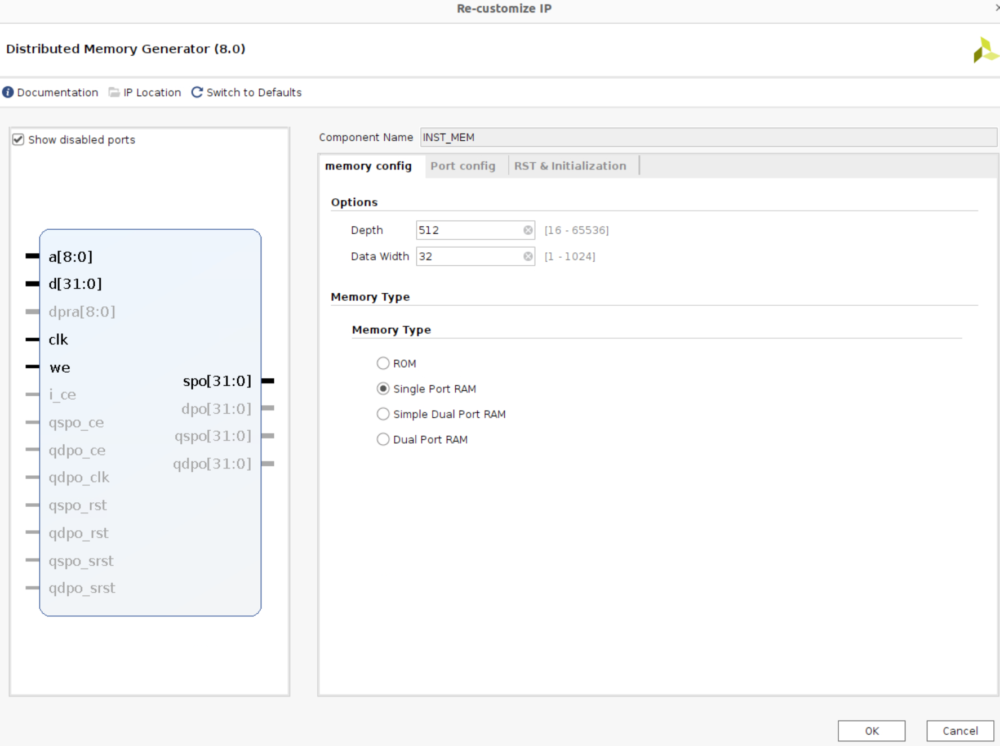

# <strong>框架介绍</strong>

仅仅完成 CPU 的设计是不够的，我们需要一些特别的工具检验并控制 CPU，这就需要仿真框架和上板框架。

本次实验的框架（已更新，最新版本 0415）在[这里](./src/vsrc_update_0415.zip)，对应的约束文件在[这里](./src/constraints_0415.xdc)。

???+ Tips "如何判断是否使用的是最新的 PDU？"

    你可以查看 TOP.v 文件的第 84 行：如果为 `.CLKOUT0_DIVIDE(64),`，则代表使用的是最新的 PDU。此外，最新的 PDU 的 TOP.v 中，clk 信号的名称为 `CLK25MHZ`。如果你下载的不是最新的 PDU，可以在清除浏览器缓存后重新下载。注意：不要通过私自修改文件的方式将 PDU 升级！


## <strong>CPU 顶层接口</strong>

!!! Warning "提醒"

    <strong>无论是 RV32I 还是 LA32R，本次实验都需要使用下面的接口！</strong>


本次实验中 CPU 的顶层模块如下所示：

```verilog linenums="1" title="CPU"
module CPU (
    input                   [ 0 : 0]            clk,
    input                   [ 0 : 0]            rst,

    input                   [ 0 : 0]            global_en,

/* ------------------------------ Memory (inst) ----------------------------- */
    output                  [31 : 0]            imem_raddr,
    input                   [31 : 0]            imem_rdata,

/* ------------------------------ Memory (data) ----------------------------- */
    input                   [31 : 0]            dmem_rdata,
    output                  [ 0 : 0]            dmem_we,
    output                  [31 : 0]            dmem_addr,
    output                  [31 : 0]            dmem_wdata,

/* ---------------------------------- Debug --------------------------------- */
    output                  [ 0 : 0]            commit,
    output                  [31 : 0]            commit_pc,
    output                  [31 : 0]            commit_inst,
    output                  [ 0 : 0]            commit_halt,
    output                  [ 0 : 0]            commit_reg_we,
    output                  [ 4 : 0]            commit_reg_wa,
    output                  [31 : 0]            commit_reg_wd,
    output                  [ 0 : 0]            commit_dmem_we,
    output                  [31 : 0]            commit_dmem_wa,
    output                  [31 : 0]            commit_dmem_wd,

    input                   [ 4 : 0]            debug_reg_ra,
    output                  [31 : 0]            debug_reg_rd
);
// ......
endmodule
```

其中：

  - `global_en` 信号为来自 PDU 的控制信号。该信号在本次实验中会控制 PC 寄存器的写使能，从而控制 CPU 是否执行指令。我们可以使用下面的代码例化 PC 寄存器：

      ```verilog linenums="1"
      PC my_pc (
          .clk    (clk        ),
          .rst    (rst        ),
          .en     (global_en  ),    // 当 global_en 为高电平时，PC 才会更新，CPU 才会执行指令。
          .npc    (cur_npc    ),
          .pc     (cur_pc     )
      );
      ```

  - `Memory (inst)` 下的接口将连接到指令存储器。请注意程序段的地址范围：RV32I 指令集 0x00400000 ~ 0x0ffffffc、LA32R 指令集 0x1c000000~0x1c7ffffc；
  - `Memory (data)` 下的接口将连接到数据存储器。本次实验中，`dmem_we`、`dmem_addr` 和 `dmem_wdata` 端口在 CPU 模块内部无需连接；
  - `Debug` 下的接口会用于仿真和上板框架，下面介绍了这些端口应当如何连接。


## <strong>CPU 与仿真框架的适配</strong>

本学期开发的仿真框架内部使用 C++ 搭建了一个经过正确性测试的 CPU（以下统称标准核）。在运行仿真时，框架会首先将用户编写的 Verilog 代码翻译成 C++ 代码（以下统称用户核）。接下来，框架会单步运行用户核与标准核，并比较二者运行的状态。如果不一致，框架会记录相应的 CPU 状态并告知用户，从而高效定位设计中可能存在的问题。

这里涉及到一个问题：如何精确描述 CPU 的状态呢？自然，我们可以记录 CPU 内部所有的信号，然后挨个进行对比。然而不同用户的设计也不完全相同，我们也不能统一各个信号的名称与作用，所以这样的思路是不现实的。事实上，CPU 的状态可以由 PC、寄存器堆和存储器的写入状态完全确定：只要保证 CPU 正确写入了这些组件，就可以保证 CPU 运行的正确性。比如：如果 ALU 结果算错了，那么最后写回寄存器堆的数据就会出错；如果分支跳转出错了，那么写入 PC 的数据就会出错；如果访存地址算错了，那么写入数据存储器的地址就会错误。

我们的仿真框架正是基于这样的思想设计的：比较每一条指令运行完成后，标准核与用户核在 PC、寄存器堆和存储器的写入状态上的异同，即可判断用户核是否存在潜在的问题。

回到我们 CPU 的端口上：

```verilog linenums="1"
output                  [ 0 : 0]            commit,
output                  [31 : 0]            commit_pc,
output                  [31 : 0]            commit_inst,
output                  [ 0 : 0]            commit_halt,
output                  [ 0 : 0]            commit_reg_we,
output                  [ 4 : 0]            commit_reg_wa,
output                  [31 : 0]            commit_reg_wd,
output                  [ 0 : 0]            commit_dmem_we,
output                  [31 : 0]            commit_dmem_wa,
output                  [31 : 0]            commit_dmem_wd,

input                   [ 4 : 0]            debug_reg_ra,
output                  [31 : 0]            debug_reg_rd
```

这些端口中，`commit` 系列的端口即为每一条指令执行完成后，提交（Commit）给仿真框架的写状态信号。其中：

- `commit` 端口用于指示当前是否有一条指令执行完成。在单周期 CPU 中，只要 PC 发生了变化，就必然有一条指令执行完成（因为一个周期执行一条指令），所以我们在后面的代码中将其设置为 1。
- `commit_pc` 为这条指令的 PC。
- `commit_inst` 为这条指令本身。
- `commit_halt` 用于指示这条指令是否是指令序列中的最后一条指令。你可能已经注意到了，Lars 在编译时会在汇编代码末尾添加一条指令 0x80000000，这条指令是我们约定的 `HALT` 指令，用于指示当前程序已经运行完成。仿真框架在获得这个信号后就会停止比对。
- `commit_reg` 系列用于指示寄存器堆的写状态。
- `commit_dmem` 系列用于指示数据存储器的写状态。

`debug` 系列的端口用于仿真框架进行更为具体的比对操作，即判断用户核的 32 个寄存器的数值是否与标准核一致。

为了同步比对的时序，我们将上述信号在 CPU 中<strong>暂存</strong>一级后给出。因此，CPU 模块的最后需要添加如下的代码：

```verilog linenums="1" title="适配框架的代码"
reg  [ 0 : 0]   commit_reg          ;
reg  [31 : 0]   commit_pc_reg       ;
reg  [31 : 0]   commit_inst_reg     ;
reg  [ 0 : 0]   commit_halt_reg     ;
reg  [ 0 : 0]   commit_reg_we_reg   ;
reg  [ 4 : 0]   commit_reg_wa_reg   ;
reg  [31 : 0]   commit_reg_wd_reg   ;
reg  [ 0 : 0]   commit_dmem_we_reg  ;
reg  [31 : 0]   commit_dmem_wa_reg  ;
reg  [31 : 0]   commit_dmem_wd_reg  ;

always @(posedge clk) begin
    if (rst) begin
        commit_reg          <= 1'H0;
        commit_pc_reg       <= 32'H0;
        commit_inst_reg     <= 32'H0;
        commit_halt_reg     <= 1'H0;
        commit_reg_we_reg   <= 1'H0;
        commit_reg_wa_reg   <= 5'H0;
        commit_reg_wd_reg   <= 32'H0;
        commit_dmem_we_reg  <= 1'H0;
        commit_dmem_wa_reg  <= 32'H0;
        commit_dmem_wd_reg  <= 32'H0;
    end
    else if (global_en) begin
        // !!!! 请注意根据自己的具体实现替换 <= 右侧的信号 !!!!
        commit_reg          <= 1'H1;                        // 不需要改动
        commit_pc_reg       <= cur_pc;                      // 需要为当前的 PC
        commit_inst_reg     <= cur_inst;                    // 需要为当前的指令
        commit_halt_reg     <= cur_inst == `HALT_INST;      // 注意！请根据指令集设置 HALT_INST！
        commit_reg_we_reg   <= rf_we;                       // 需要为当前的寄存器堆写使能
        commit_reg_wa_reg   <= rf_wa;                       // 需要为当前的寄存器堆写地址
        commit_reg_wd_reg   <= rf_wd;                       // 需要为当前的寄存器堆写数据
        commit_dmem_we_reg  <= 0;                           // 不需要改动
        commit_dmem_wa_reg  <= 0;                           // 不需要改动
        commit_dmem_wd_reg  <= 0;                           // 不需要改动
    end
end

assign commit               = commit_reg;
assign commit_pc            = commit_pc_reg;
assign commit_inst          = commit_inst_reg;
assign commit_halt          = commit_halt_reg;
assign commit_reg_we        = commit_reg_we_reg;
assign commit_reg_wa        = commit_reg_wa_reg;
assign commit_reg_wd        = commit_reg_wd_reg;
assign commit_dmem_we       = commit_dmem_we_reg;
assign commit_dmem_wa       = commit_dmem_wa_reg;
assign commit_dmem_wd       = commit_dmem_wd_reg;
```

!!! Danger "HALT 指令"

    <strong><font color=#FF0000>
    请根据你所使用的指令集正确设置 HALT 指令
    </font></strong>

    为了保证汇编程序运行完成后，PDU 能够知道 CPU 已经运行完成，CPU 需要在程序执行完成后向 PDU 发出一个特殊的信号，在这里就是我们的 `halt` 信号。为此，我们可以在汇编程序最后添加一个特殊的「指令」，保证其不会被用在正常的汇编程序中即可。

    - 对于 RV32R 指令集，你可以使用 `ebreak` 指令，它对应的机器码是 0x00100073，因此我们需要将 `HALT_INST` 设置为 32'H00100073。你可以在汇编代码的最后添加一条 `ebreak` 指令，以标识程序的结束；
    - 对于 LA32R 指令集，我们的仿真框架规定了中断指令的机器码是 0x80000000，因此在硬件设计时需要保持一致。你需要手动在 COE 文件的末尾添加这条机器码。这样，当程序执行到这一条「指令」时，CPU 就可以产生 `commit_halt` 信号，进而被 PDU 捕捉到。


## <strong> 上板框架概述 </strong>

本次实验提供的上板框架基本结构如下：

<figure markdown>
{ width="600" }
<figcaption>项目框架</figcaption>
</figure>

项目的文件结构如下：

```
vsrc
├─ CPU  <---------------------------------- 你只需要修改 CPU 目录下的内容
│  └─ CPU.v
├─ MEM  <---------------------------------- 内存管理
│  ├─ MEM_BRIDGE.v
│  └─ MMIO.v
├─ PDU  <---------------------------------- PDU 及其附属模块
│  ├─ PDU.v
│  ├─ RTL
│  │  ├─ BP_LIST_REG.v  <------------------ 用于记录并处理断点
│  │  ├─ INFO_SENDER.v  <------------------ 用于向串口输出提示信息
│  │  └─ PDU_decode.v <-------------------- 用于对串口数据进行译码
│  ├─ UART
│  │  ├─ UART_RX.v
│  │  └─ UART_TX.v
│  └─ UTILS
│     ├─ HEX2ASCII.v
│     ├─ HEX2UART.v
│     ├─ POSEDGE_GEN.v
│     ├─ QUEUE.v
│     └─ Segment.v
└─ TOP.v  <-------------------------------- 项目的顶层文件
```

其中，我们在 TOP.v 文件中例化了指令存储器和数据存储器。为此，你需要在自己的项目中创建两个分布式存储器 IP 核，并按照下图所示的参数进行配置（注意将 IP 核命名为 INST_MEM 和 DATA_MEM）：


<figure markdown>
{ width="600" }
<figcaption>配置指令存储器 IP 核</figcaption>
</figure>
<figure markdown>
{ width="600" }
<figcaption>配置数据存储器 IP 核</figcaption>
</figure>

完成后，在 Vivado 的项目中将 vsrc 文件夹导入，即可使用本次实验的上板框架。
