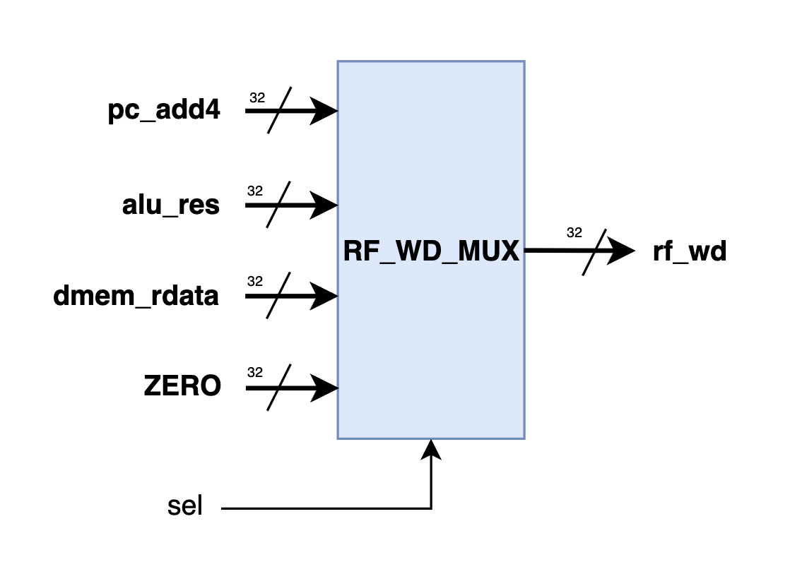

# <strong> 单周期 CPU</strong>


## <strong>整体框架</strong>

<figure markdown>
{ width="800" }
<figcaption>CPU 数据通路</figcaption>
</figure>


上图展示了本次实验中 CPU 的数据通路。该数据通路可以兼容 RV32I 版本的 CPU 和 LA32R 版本的 CPU，二者仅在译码器 Decoder 的内部结构上不同。此外，<strong>通路中省略了控制信号，例如 alu_op、rf_we 等。</strong>

## <strong>模块设计</strong>

### <strong>NPC 选择器</strong>

与简单单周期不同的是，单周期 CPU 需要能够执行分支指令，所以下一个周期的 PC 值就不一定是 PC + 4 了。为此，我们需要一个数据选择器选择合适的值来传递给 PC 寄存器，以下是其示意图。


<figure markdown>
{ width="400" }
<figcaption>NPC 选择器示意图</figcaption>
</figure>

其中，`pc_j` 端口对应 jalr 指令的结果，该输入为将 `alu_res` 的结果最低位置为 0。

???+ Tips "La32R 指令集"

    在 LA32R 指令集中，与 jalr 指令对应的是 jirl 指令，但该指令不需要将最低位置位 0。因此，对于选择 LA32R 指令集的同学，可以自主选择是否需要这个 `pc_j` 端口。

### <strong>分支模块</strong>

与教材不同，我们把条件跳转指令的逻辑判断从 ALU 中移出，封装成了独立的模块。 Branch 模块是专门用来处理分支指令的模块。它接收来自 Decoder 的控制信号，以及来自寄存器堆的两个数据。根据这两个数据之间的大小关系以及控制信号， Branch 模块最终产生相应的跳转信号。以下是本次实验中的分支模块结构示意图。

<figure markdown>
{ width="400" }
<figcaption>分支模块示意图</figcaption>
</figure>


其端口代码为：

```verilog  linenums="1"  title="分支模块"
module BRANCH(
    input                   [ 3 : 0]            br_type,

    input                   [31 : 0]            br_src0,
    input                   [31 : 0]            br_src1,

    output      reg         [ 1 : 0]            npc_sel
);
```

各个端口的作用是：

- br_type：分支跳转的类型；
- br_src0、br_src1：来自寄存器堆的两个数据；
- npc_sel：npc 选择器的控制信号；

### <strong>译码器</strong>

为了实现完整的单周期 CPU ，你需要修改你在 lab3 中的 Decoder 设计，处理简单单周期中没有实现的指令，以下是本次实验中的译码器的结构示意图。

<figure markdown>
{ width="400" }
<figcaption>译码器模块示意图</figcaption>
</figure>

其端口代码为：

```verilog  linenums="1"  title="译码器"
module DECODER (
    input                   [31 : 0]            inst,

    output      reg         [ 4 : 0]            alu_op,

    output                  [ 3 : 0]            dmem_access,

    output      reg         [31 : 0]            imm,

    output                  [ 4 : 0]            rf_ra0,
    output                  [ 4 : 0]            rf_ra1,
    output                  [ 4 : 0]            rf_wa,
    output                  [ 0 : 0]            rf_we,
    output      reg         [ 1 : 0]            rf_wd_sel,

    output                  [ 0 : 0]            alu_src0_sel,
    output                  [ 0 : 0]            alu_src1_sel,
    
    output                  [ 3 : 0]            br_type
);
```

相较于 lab3 ，新增的各个输出端口的作用是：

- dmem_access：访存类型；
- rf_wd_sel：寄存器堆写回数据选择器的选择信号；
- br_type：分支跳转的类型；

这些信号的生成和 lab3 中描述的一样，都需要根据 inst 的数值，结合对应指令集的译码规则得出。

### <strong>访存控制单元</strong>

访存控制单元主要是用于实现非整字访存指令的。例如：如果我们想要带符号地读取 0x5 地址上的字节的值，我们就需要先读取 0x4 开始的四个字节上的数据，再取出其中的第 8~15 位，右移 8 位并符号扩展之后写入目标寄存器，总结起来就是：

`x[rd] = {{24{(M[0x4])[15]}}, (M[0x4])[15:8]}`

如果我们想要向 0x5 地址上写入一个字节的数据 0x12，为了不影响其余字节的数据，就需要先将它们读出，与待写入的数据拼接之后再写回。因此，实际执行的操作就是：

`M[0x4] = {(M[0x4])[31:16], (x[rd])[7:0], (M[0x4])[7:0]}`

我们的 SL_UNIT 就需要根据指令的具体类型实现上述的访存操作。

<figure markdown>
{ width="400" }
<figcaption>访存控制单元示意图</figcaption>
</figure>

```verilog  linenums="1"  title="访存控制单元"
module SLU (
    input                   [31 : 0]                addr,
    input                   [ 3 : 0]                dmem_access,

    input                   [31 : 0]                rd_in,
    input                   [31 : 0]                wd_in,

    output      reg         [31 : 0]                rd_out,
    output      reg         [31 : 0]                wd_out
);
```

各个端口的作用是：

- addr：访存的地址；
- dmem_access：访存类型；
- rd_in：从存储器读到的原始数据；
- wd_in：要写入存储器的原始数据；
- rd_out：根据 dmem_access 处理过的读到的数据；
- wd_out：根据 dmem_access 处理过的要写入的数据；

???+ Tips "提示"

    在正常情况下，CPU 要求半字访问指令 ld.h（lh）、ld.hu（lhu）、st.h（sh）仅会访问一个字中的低半字（0、1 字节）或高半字（2、3 字节），不会出现跨字访问或中间访问（1、2 字节）。因此，SL_UNIT 需要根据输入的 `dmem_access` 信号，结合 ALU 计算出的访问地址判断此时是否是合法的访问。对于真实的处理器来说，此时会抛出一个「非对齐访问」的异常信号，而我们的单周期 CPU 目前还没有这个功能，因此遇到非正常的半字访问，SL不做处理即可。

    

### <strong>寄存器堆写回选择器</strong>

要写回寄存器堆的数据来源由你的 CPU 具体实现决定，在助教的实现中，要写回的数据有四个来源，PC 加四，ALU 的结果、从存储器读到的值和 0。实际上这里的 0 是没有实际作用的，但三选一和四选一选择器的资源开销基本一致，所以我们额外引入了一个输入端口，用一个四选一数据选择器用于控制写回的数据，一个简单的参数化选择器实现如下：

```verilog linenums="1" title="四选一选择器"
module MUX2 # (
    parameter               WIDTH                   = 32
)(
    input                   [WIDTH-1 : 0]           src0, src1, src2, src3,
    input                   [      1 : 0]           sel,

    output                  [WIDTH-1 : 0]           res
);

    assign res = sel[1] ? (sel[0] ? src3 : src2) : (sel[0] ? src1 : src0);

endmodule
```

四选一选择器的四个来源分别是：

- pc_add4
- alu_res
- dmem_rdata
- ZERO

以下是结构示意图：

<figure markdown>
{ width="400" }
<figcaption>寄存器堆写回选择器示意图</figcaption>
</figure>