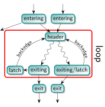
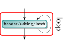
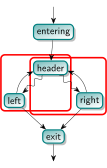
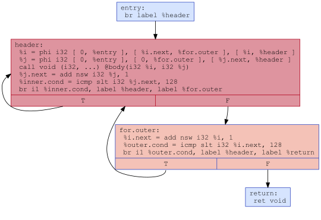
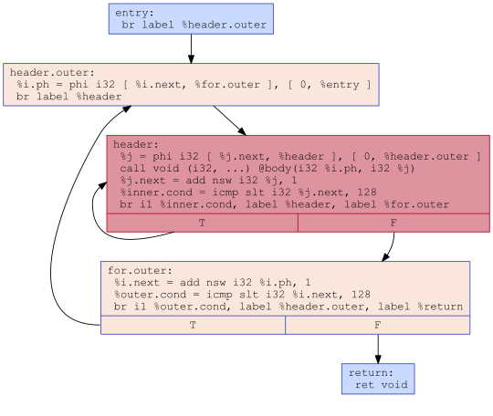

# 循环的定义与相关术语

## Loop定义

Loop是代码优化中的一个重要概念。我们仿照`LLVM`中的实现，给出具体定义如下：

一个循环是控制流图（CFG；其中每个节点代表了一个基本块）中具备以下特性的节点形成的子集：

1. 导出子图（即CFG中loop和他们之间的边形成的子图）是强连通的（Strongly Connected）。这意味着，从循环内任意节点出发，都可以到达循环内的任意节点。
2. 所有从循环外部指向该子集的边都指向同一个节点，这个节点被称为**header**。因此，头节点支配整个循环中的所有节点（即，任何到达循环内任意节点的路径，都会经过头节点）。
3. 该子集是符合以上条件的最大子集。也就是说，我们无法在该子集中添加更多的节点，且保持子图仍然是强连通的，并且头节点不变。

在我们的课程中，这通常被称为**自然循环**。在中文语境中，loop和cycle都能被翻译为循环，但一般而言，[cycle](https://llvm.org/docs/CycleTerminology.html#cycle-terminology)指的是一个更加宽泛的概念。为了避免混淆，我们在下文中所描述的循环都是上面所定义的loop。

### 一些额外的定义

- **Entering block**(或 Loop Predecessor)：指的是一个不在循环中的节点，它有一条边指向循环的头节点。如果只有一个进入块，并且这条边唯一指向头节点，那么这个进入块也叫做**preheader**。**preheader**支配循环中的所有节点，但它本身不是循环的一部分。
- **Latch**：有一条边指向头节点（header）的循环内节点。
- **Backedge**：从Latch指向header的边。
- **Exiting Edge**：从loop内部指向外部的边。它从**exiting block**指向**exit block**。



### 一些其他的说明

- 每个节点最多只能是一个循环的头节点，因此一个循环可以通过其头节点来唯一标识。
- 对于从函数入口不可达的基本块，循环的概念是未定义的，因为支配关系也未定义。
- 最小的循环是由一个指向自己的基本块。在这种情况下，这个块既是header也是latch(如果有指向其他基本块的边还是exiting block)。

- 循环可以相互嵌套。也就是说一个循环可以是另一个循环的子集，并且它们具有不同的头节点。一个函数中循环的层次结构形成了一个森林，其中每个顶层循环都是它内部嵌套循环的根节点。
- 两个循环不可能只有部分节点相同。两个循环要么完全不重叠，要么是一个嵌套在另一个里面。在下面的例子中，左边的子集和右边的子集都不是循环，他们都违反了循环定义中的第三条，即不是极大的子集。两个子集的并集才是一个循环。

- 有时，两个语义上的循环可能共享同一个头节点，但在这里会被视为一个单独的循环。例如，下面的嵌套循环：

  ```cpp
  for (int i = 0; i < 128; ++i)
    for (int j = 0; j < 128; ++j)
      body(i, j);
  ```

    在`LLVM-IR`中他们可能会被如下的方式所表示。这里只有一个头节点，因此会被视为一个循环。



在`LLVM`中，[LoopSimplify](https://llvm.org/docs/LoopTerminology.html#loop-terminology-loop-simplify)会将这个循环分解为两个循环。但为了简化实验，我们在这里**并不涉及该pass**。


