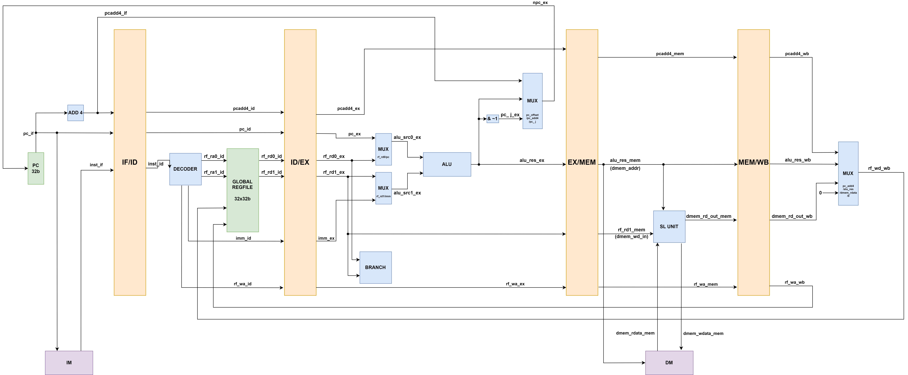

# <strong>流水线 CPU</strong>

## <strong> 循环的代价 </strong>

表面来看，从上一部分最后的图出发，只要将 npc_ex 连回 pc、寄存器与数据储存器连接合适的写入，我们就完成了单周期 CPU 的流水化。然而，问题还远远没有解决，这一切的成因都是“循环”，也即与之前的简单部分不同的，输出会导致输入的差别。

### <strong> 数据储存器 </strong>

为了说清楚直接连接的问题，我们先观察唯一并不会出问题的数据储存器单元。直接将生成的写数据连到数据储存器的输入，我们可以得到：

<figure markdown>
{ width="900" }
<figcaption>直接连接数据储存器</figcaption>
</figure>

下面考虑每个周期 PC 都更新的场景。随着指令一级级流转，数据储存器不断被更改。但是，由于<strong>数据储存器的读写在同一级</strong>，每个指令来到 MEM 段时，上一个指令一定已经完成了写入，因此读到的一定是最新的数据。

### <strong> 寄存器堆 </strong>

然而，这样美好的情况对寄存器堆不再成立。由于寄存器堆的更新在 WB 阶段，而使用在 ID 阶段，如果每个周期 PC 都更新，当某条指令到达 ID 阶段时，上一条指令刚刚到达 EX 阶段，也即还需要三个周期（到达 MEM、到达 WB、成功写入）才能最终写入。

!!! Danger "依赖关系"  
    上一部分的简单例子中，之所以不会出现这样的问题，是因为我们假设输出 res 与输入 a、b、c、d 独立。但 CPU 的情况里，输出的区别写入后即会影响输入的结果，这样的依赖关系导致了问题。

### <strong> PC 更新 </strong>

当然，如果我们考虑会使 PC 跳转的指令，问题则会更大——PC 跳转的结果在 EX 段才能正确计算，而我们假设 PC 一条条更新时，从前一次 PC 更新到下一次的正确 PC 被更新，也需要三个周期（进入 ID、进入 EX、更新 PC）。

跳转的问题与寄存器堆的写入问题导致我们必须改进这个流水化的方案。从逻辑上来说，PC 更新和寄存器堆等待的周期都是无法减少的，也就是我们的 CPU 至少需要<strong>三周期</strong>执行一条指令，这也是本次实验的最终结果，在下次实验中，我们方才探讨更多优化的可能。

## <strong> 三周期 CPU </strong>
### <strong> 段间寄存器 </strong>

首先，是时候细化我们之前提到的段间寄存器模块了。从最简单的角度来说，它只需要在每个时钟上升沿将输入传递到输出，不过，为了方便后续的操作，我们需要额外添加四个接口，即 rst、en、stall 和 flush：

* rst 的效果为同步清空，当此信号高电平时段间寄存器的所有寄存器都将被清空，与 CPU 的 rst 信号连接。
* en 的作用是让段间寄存器受到 PDU 的控制，保证其与 PC 寄存器 en 端口的同步。段间寄存器的 en 端口同样连接到 `global_en`。
* stall 的效果为停驻，若时钟上升沿此信号高电平，输出仍保持之前的值不变，而非接收输入（也即其是反向的写使能信号）。
* flush 的效果为同步清空，若时钟上升沿此信号高电平，段间寄存器的所有寄存器都将被清空。

一个可以参考的框架如下：

```verilog
always @(posedge clk) begin
    if (rst) begin
        // rst 操作的逻辑
    end
    else if (en) begin
        // flush 和 stall 操作的逻辑, flush 的优先级更高
    end
end
```

<strong>在本次实验中，段间寄存器不会 stall，但需要被 flush。</strong>

??? Warning "什么是清空？"
    很值得一提的是，清空未必是清零，例如 PC 清空就是回到初始位置。事实上，清空段间寄存器意味着将该段变为（也即调整所有的数据与控制信号）执行一条“什么都不做”的指令，也就是 nop 指令。请根据你使用的指令集自行实现正确的清空。

除此以外，段间寄存器其实有两种实现方式。直观的想法是，如数据通路一样，每段将该段需要传递的信号传递给下一段，忽略其他信号。然而，这么做会产生两个问题：

1. 每段的段间寄存器需要重新设计。但有些信号（如寄存器堆写使能 rf_we）事实上需要多次传递，
而有些信号（如寄存器堆的读地址 rf_ra1）则在最初设计时看似不要传递，在处理数据相关时（下一次实验将涉及）
却发现需要传递。设计过程中对模块接口不断的复制、修改容易引起混乱。

1. 如果信号只保留有限的生命周期，则调试时需要反复查看不同段落正在执行的指令，
这加大了调试的难度。

因此，我们推荐使用统一的段间寄存器模块，让信号一经产生就传递到最后，从而简化了段间寄存器的设计。
对于在上一阶段尚未产生的信号，直接在输入处接 0，忽略其输出，即只保留有效端口的使用——当然，这样也就会导致我们的段间寄存器十分庞大（去年的实验中，它共有 73 个输入输出端口）。

!!! Danger "无需输入/输出时的处理"
    在 Verilog 中，模块的输出端口允许空置，但输入端口不允许，否则会发生错误。因此对于无用的输入，可以将其端口置 0。例如

        .useless_input(32'b0)  // A 32-bits useless input port

### <strong> PC 与寄存器堆的同步 </strong>

接下来，让我们直接将 npc 与 rf_wd 都连接上，得到一个“流水线 CPU”：

<figure markdown>
{ width="900" }
<figcaption>简单流水线 CPU 数据通路</figcaption>
</figure>

考虑这样的场景：PC 每<strong>三个周期</strong>更新一次。此时，PC 更新恰好是在上一个 npc_ex 已经计算出时，跳转的问题已经解决。然而，就寄存器堆而言，问题并没有这么简单。

考虑如下两条 RV32I 指令：

    addi x1, x0, 1
    addi x2, x1, 1

由于 PC 三周期更新一次，当前一条指令在 EX 阶段的下一个周期，也即前一条指令进入 MEM 阶段时，后一条指令进入 IF 阶段；而前一条指令进入 WB 阶段时，后一条指令进入 ID 阶段。然而，WB阶段得到的 x1 值 1 需要在下个周期才能写入，后一条指令读到的事实上是 x1 之前的值。

为了解决这一问题，我们需要将寄存器堆改为<strong>写优先</strong>，也即，在读寄存器时，若<strong>下个周期即将向这个寄存器写入值</strong>时，应直接利用组合逻辑读出将写入的值。

???+ Warning "关于 0 号寄存器"
    下个周期是否将写入值可以通过 we 与 wa 综合判断。由于保持恒 0 的零号寄存器不应该被写入值，它应该被特殊判断。

这样一来，我们的流水线 CPU 就可以在三周期一条指令的情况下正常运行了。不过，还有最后一个，也是最关键的问题，怎么保证三周期进行一条指令呢？

### <strong> 硬件 vs 不那么硬件 </strong>

这时，可能有同学想到段间寄存器原先的 stall 与 flush 端口，它们是否可以调控指令执行，使得三周期的要求满足呢？事实上，只要增加计数器模块，每个指令进入 ID 后，接下来的两周期 flush 掉 IF 到 ID 的段寄存器，并 stall 住 PC，即可完成。（思考：为什么？）

不过，本次实验中，我们可以采用一个远比它简单的办法：助教们在提供指令测试时，每个指令后都有两个 nop 指令，这样的“预处理”后，我们就可以无需计数器连续执行指令，实现正确的效果。
 
## <strong> 对于仿真框架的适配 </strong>

对跳转指令来说，它会导致 PC 两次加 4 后才跳转到正确的地址，但因为两次加 4 遇到的都是 nop，实际上并不会影响整个汇编代码的结果。然而，仿真框架要求这两条 nop 不能进行「提交（commit）」操作（尽管它最终写入了零号寄存器，不会带来实质性影响），否则会判定你程序运行错误。为此，你需要在跳转错误时为段间寄存器生成正确的 flush 信号，将这两条指令的 commit 信号清空。

那么应该怎么操作呢？在流水线 CPU 中，我们在 EX 段发现分支错误，此时 IF、ID 段是两条 nop 指令。因此，我们可以在下一个时钟的上升沿 flush IF/ID、ID/EX 两个段间寄存器，从而将这两条 nop 指令的 commit 操作「消除」。需要注意的是，commit 信号是需要被清零的！这样仿真框架就不会比对这两条 nop 指令，而是等到下一条能够 commit 的指令到来后再继续比对。

下面是一个参考的代码：

```verilog linenums="1"
assign commit_if = 1'H1;    // 这个信号需要经过 IF/ID、ID/EX、EX/MEM、MEM/WB 段间寄存器，最终连接到 commit_reg 上

always @(posedge clk) begin
    if (rst) begin
        commit_reg          <= 1'H0;
        commit_pc_reg       <= 32'H0;
        commit_inst_reg     <= 32'H0;
        commit_halt_reg     <= 1'H0;
        commit_reg_we_reg   <= 1'H0;
        commit_reg_wa_reg   <= 5'H0;
        commit_reg_wd_reg   <= 32'H0;
        commit_dmem_we_reg  <= 1'H0;
        commit_dmem_wa_reg  <= 32'H0;
        commit_dmem_wd_reg  <= 32'H0;
    end
    else if (global_en) begin
        // 这里右侧的信号都是 MEM/WB 段间寄存器的输出
        commit_reg          <= commit_wb;
        commit_pc_reg       <= pc_wb;
        commit_inst_reg     <= inst_wb;
        commit_halt_reg     <= inst_wb == `HALT_INST;
        commit_reg_we_reg   <= rf_we_wb;
        commit_reg_wa_reg   <= rf_wa_wb;
        commit_reg_wd_reg   <= rf_wd_wb;
        commit_dmem_we_reg  <= dmem_we_wb;
        commit_dmem_wa_reg  <= dmem_addr_wb;
        commit_dmem_wd_reg  <= dmem_wdata_wb;
    end
end

assign commit               = commit_reg;
assign commit_pc            = commit_pc_reg;
assign commit_inst          = commit_inst_reg;
assign commit_halt          = commit_halt_reg;
assign commit_reg_we        = commit_reg_we_reg;
assign commit_reg_wa        = commit_reg_wa_reg;
assign commit_reg_wd        = commit_reg_wd_reg;
assign commit_dmem_we       = commit_dmem_we_reg;
assign commit_dmem_wa       = commit_dmem_wa_reg;
assign commit_dmem_wd       = commit_dmem_wd_reg;
```

???+ Note "关于 global_en"

    现在，`global_en` 信号会控制三个部分：PC 寄存器、commit 寄存器以及段间寄存器。

???+ Note "一点补充"
    由于我们事实上是可以让 PC 连续执行的，一个很值得思考的问题是，到底怎样的指令序列才能保证执行结果正确？一定要每个指令后跟着两个 nop 吗？事实上，任务 2 中的指令序列就是可以连续正确执行的——准确来说，任何<strong>无跳转、寄存器从更新到使用至少相隔两条指令</strong>的序列都是可以在这个无冒险流水线 CPU 中连续正确执行的。因此，我们实验标题仍称其为简单流水线 CPU，而非多周期 CPU。