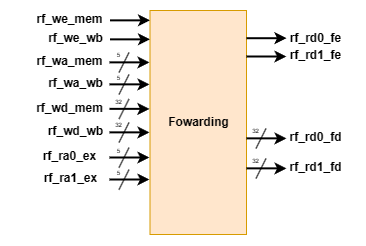

# <strong>完整流水线 CPU</strong>
### <strong> 数据通路修正 </strong>

在介绍冒险处理前，我们必须对之前的 PC 模块进行调整：PC 模块在流水线的中的地位也相当于一个<strong>段间寄存器</strong>，因此需要添加 stall 与 flush 信号。此外，由于需要考虑前递，上一个实验数据通路中的 rf_ra0_id 信号与 rf_ra1_id 信号必须通过段间寄存器<strong>传入 EX 段</strong>。

???+ Note "数据通路在哪里"
    由于增添前递与冒险模块会使数据通路显得过于复杂，本文档中只描述端口与连接，这对写代码已经足够，有兴趣的同学可以在 RIPES 等软件中直接查看含有冒险处理的数据通路形式。除了冒险处理部分外，本次实验的数据通路与上一次完全一致。

## <strong> 前递模块 </strong>
### <strong> 模块介绍 </strong>
为了解决数据冒险中可以前递的情况，前递模块的示意图如下：

<figure markdown>
{ width="300" }
<figcaption>前递模块</figcaption>
</figure>

这里对端口进行简单解释：

* rf_we 指寄存器堆写使能信号，WB 与 MEM 段都需传入前递单元。
* rf_wa 指寄存器堆写地址，WB 与 MEM 段都需传入前递单元，用于比对。
* rf_wd 指寄存器堆写数据，在 WB 段直接传入即可，在 MEM 段可将 alu_res 传入（见下方解释）。
* rf_ra0_ex 与 rf_ra1_ex 为本次实验中要求传入 EX 段的信号，用于与 MEM 段、WB 段信号比对确定前递是否发生。
* rf_rd0_fe 与 rf_rd1_fe 为前递使能信号，为 1 代表前递发生。
* rf_rd0_fd 与 rf_rd1_fd 为前递数据信号，当前递使能为 1 时即代表前递的数据。

???+ Note "前递模块的简化"
    事实上，完整流水线 CPU 中 rf_wd_sel_mem 与 pcadd4_mem 无需传入前递模块，发生前递时直接前递 alu_res，结果仍然是正确的，这是因为 jalr 指令会使得接下来两条指令被冲刷掉，即使检测到了前递，也是无效的。由此，也可选择前递模块只生成<strong>两位</strong>的控制信号 rf_rd0_fe 与 rf_rd1_fe，控制一个选择寄存器堆读取数据、alu_res_mem、rf_wd_wb 的三选一 MUX，这也是书上的实现方式。

### <strong> 接入 CPU </strong>
为将前递模块连接入 CPU，需要将上个实验中的 rf_rd0_ex 信号改名为 rf_rd0_raw_ex，真正的 rf_rd0_ex 将由 rf_rd0_raw_ex 与 rf_rd0_fd 通过 rf_rd0_fe 选择得到，对 rf_rd1_ex 同理。

???+ Warning "注意信号的多次使用"
    无论是传入 ALU、Branch 还是下一个段间寄存器的 rf_rd0_ex 与 rf_rd1_ex 信号，都应替换为选择得到的结果。

此模块正确接入 CPU 后，应当能够通过不含 Load-Use 与控制冒险的代码测试。

## <strong> 段间寄存器控制模块 </strong>
### <strong> 模块介绍 </strong>
最后，为了解决 Load-Use 冒险与控制冒险，我们必须对段间寄存器进行控制。模块示意图如下：

<figure markdown>
{ width="400" }
<figcaption>段间寄存器控制模块</figcaption>
</figure>

这里对端口进行简单解释：

* rf_we 指寄存器堆写使能信号，EX 段需要传入以判断 Load-Use 冒险。
* rf_wd_sel 指寄存器堆写数据的选择，EX 段需要传入以判断 Load-Use 冒险。
* rf_wa 指寄存器堆写地址，EX 段需要传入以判断 Load-Use 冒险。
* rf_ra0_id 与 rf_ra1_id 用于比对确定 Load-Use 冒险是否发生。
* npc_sel 为下个 PC 选择器的控制信号，用于确定控制冒险是否发生。
* 输出信号为各段间寄存器对应的 stall 与 flush 信号。

### <strong> 接入 CPU </strong>
为将段间寄存器控制模块接入 CPU，我们需要正确接入信号，并接出到对应的 stall 与 flush 端口。在最终完成的 CPU 里，除了跳转指令需要三周期、Load-Use 冒险发生的情况需要两周期外，其他情况可以做到一周期一条指令，大大改进了执行速度。

???+ Note "能否继续改进？"
    在拆成五阶段的情况下，最大的周期增加来自跳转指令。以 RV32I 为例，对于 jal，我们事实上可以在 ID 阶段完成跳转，从而减少一个周期，而对 B 系列指令，如果我们通过某种方式对是否跳转进行预测（事实上当前相当于均预测不跳转），也可概率降低消耗的周期。这两个策略分别称为<strong>跳转提前</strong>与<strong>分支预测</strong>。

    此外，为了进一步降低时钟周期的大小，需要时间最多的访存环节（无论是对指令还是数据）也可以优化，这就是下个实验涉及的<strong>缓存</strong>相关内容了。