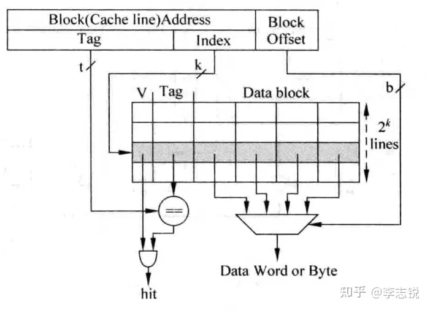
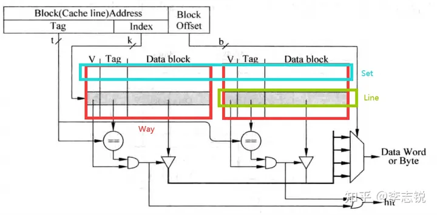
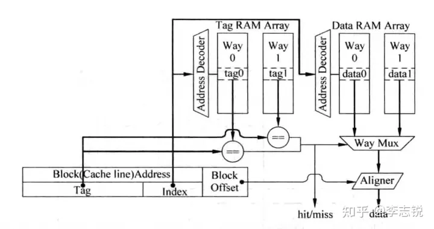
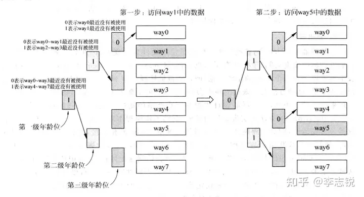

# <strong>高速缓存 Cache</strong>

!!! Note
    Cache存在的意义在于解决时间相关性与空间相关性问题。

目前现代的超标量处理器都是哈佛结构，为了让高速处理器匹配低速的存储器，通常采用的多级Cache结构。其中，通常L1 Cache分为ICache与DCache，分别用于指令和数据。ICache的设计一般只需要考虑读取的情况，而DCache还需要考虑写入的情况。而本次实验是为了实现一个兼具读写Cache，可以看作为一个DCache。

Cache由两部分组成：Tag与Data，其中Data部分用来保存一片连续地址的数据，而Tag部分则存储这片连续数据的公共地址，**一个Tag与其对应的Data构成的一行称为一个Cache Line**，而Cache Line中的数据部分称为数据块（Data Block），如果一个数据可以存储在Cache中的多个地方（一般是多路设计的情况下），**这些被同一个地址找到的多个Cache Line称为一个Cache Set**。

Cache分为三种主要的实现方式：

- 直接映射（Direct-mapped） Cache
- 组相连（Set-associative） Cache
- 全相连（Fully-associative）Cache。

## 直接映射Cache

这种结构的Cache是最容易实现的一种Cache，可以认为是只有一个Way的组相连Cache，处理器访问存储器的地址会被分为三个部分：Tag、Index以及Block Offset，结构如下图所示：

其之所以被称作直接映射，是因为地址中的Index字段直接作为Cache Line地址，这样，对于所有Index相同的存储器地址，都会寻址到同一个Cache Line，这就产生了冲突，这也是直接映射结构Cache的一大缺点。这种结构甚至简单到不需要替换算法，但是其执行效率也是最低的，现代处理器中很少会使用这种方式了。

## 组相连Cache

这种方式的提出是为了解决直接映射Cache最大的一个问题：Index相同的数据只能放在一个Cache Line中。

组相连Cache使用了Cache Set的概念，一个Cache Set包含多个Cache Line，这些Cache Line的Index都相同。当一个Cache Set中的某一个Cache Line被占用，而另一个Cache Line空闲时，就不必踢掉已有的数据，而是使用空闲的槽位，这样就大大降低了缺失率，而一个Cache Set所包含的Cache Line就被成为这个Cache的相连度。例如，若一个Cache Set包含两个Cache Line，则这个Cache称为2路组相连Cache，结构如下图所示：

上图中可以看到，Cache被分成了两个存储区域。其中，**一个存储区域叫做一“路”**。

可以看到，由于需要从多个Cache Line中选择一个匹配的结果，因此这种实现方式相对于直接映射结构的Cache而言延迟会更大，有时候甚至需要将其访问过程流水化，以减少对处理器频率的影响，这样会导致load指令的延迟（Latency）增大，一定程度上影响了处理器的执行效率，但是这种方式的优点在于，它可以显著地减少Cache缺失发生的频率，因此在现代的处理器中得到了广泛的应用。

在实际实现中，Tag和Data部分实际上是分开的，分别叫做Tag SRAM和Data SRAM。对于这种实现，可以采用并行访问（即同时访问Tag SRAM和Data SRAM）及串行访问（即先访问Tag SRAM再访问Data SRAM）方法。

!!! Note
    
    在本次实验中，Tag和Data均采用BRAM并行访问实现

对于并行访问方法而言，在读取Tag的同时，需要将每一路Index对应的的Data部分全部读取出来，然后送到多路选择器上，这个多路选择器受到Tag比较结果的控制，选出对应的Data Block，然后根据存储器地址中Block Offset的值，选择出合适的字节，一般将选择字节的这个过程称为数据对齐（Data Alignment）

!!! Note

    本次实验仅考虑并行访问的实现，如果命中 Cache 只需要一个周期就可以将对应数据读出。而串行访问的实现效率较低，不予考虑。

## 全相连Cache

这种Cache实际上可以认为是只有一个Set的组相连Cache，在这种Cache中，存储器地址中将不再有Index部分，因为数据可以放在任何一个Cache Line中，这实际上就是一个内容寻址的存储器（Content Address Memory，CAM），在实际设计中，通常采用Tag CAM + Data SRAM的结构，以减少CAM过大所引起的走线延迟问题，并因此导致这种结构的Cache一般容量都不会太大，多见于TLB的设计中。

## Cache的写入策略

由于一般ICache不会被直接写入内容，即使有自修改（Self-modifying），也通常是借助DCache实现的，因此，这里仅讨论DCache的写入策略。

DCache的写入策略可以总结为写通（Write Through）和写回（Write Back）。所谓写通是指，对Dache的所有写入操作会被同时在其下级存储器上执行，但由于下级存储器的访问时间一般来说比较长，而store指令在程序中出现的频率又比较高，这样必然会导致处理器的执行效率下降；所谓写回则是指，数据写到DCache后，对应的Cache Line会被标记为Dirty，只有当这个Cache Line被替换时，其数据才会写入下级存储器，这种方式会大大提升处理器的执行效率，但是会造成DCache与下级存储器的数据不一致（Non-consistent）问题。

上面的讨论都是假设在写DCache时，要写入的地址已经存在与DCache中，但事实上这个地址有可能并不存在于DCache中，这就发生了写缺失（Write Miss），这种情况的处理策略也可以总结为两种：Non-Write Allocate与Write Allocate。所谓Non-Write Allocate是指，直接将数据写到下级存储器中，而并不写到DCache中；所谓Write Allocate是指，首先将写入地址对应的整个数据块取回DCache中，然后再将写入到DCache中的数据合并到这个数据块中，之所以需要先取回，是因为一次写操作的数据量远远小于一个数据块的大小，如果不进行取回则直接写入DCache并标记Dirty，后期写回处理器时，必然会造成其周围的数据被破坏。一般来说，写通总是配合Non-Write Allocate使用，而Write Back则通常和Write Allocate配合使用。可以看出，Write Back与Write Allocate配合的方式设计复杂度是最高的，但是其效率也是最好的。

!!! Note
    本次实验给出的直接映射Cache就是采用的写回写分配的写入策略。

## Cache的替换策略

首先，只有组相连和全相连Cache才需要考虑替换策略，其次，只有当一个Cache Set对应的所有的Cache Line都用完（对于组相连）或所有Cache Line都用完（对于全相连）时，才需要考虑替换策略（否则直接将数据填到空闲Cache Line即可，不需要做替换），这里介绍几种最常用的替换算法。

### 近期最少使用法（LRU）

这种方法会选择最近被使用次数最少的Cache Line，为此，需要给每个Cache Line设置一个年龄（Age）字段，每当一个Cache Line被访问时，其他Cache Line的年龄都会加一，而被访问的Cache Line的年龄会被清零，每次替换年龄最大的那一行 Cache Line。这种方法的优点在于，它可以保证被频繁访问的数据不会被替换，因此，LRU替换策略的缺失率理论上是最低的。

但是，随着Cache相关度的增加，这种策略实现非常昂贵，因此，对于相关性很高的Cache，通常都是使用伪LRU方法，即将所有的way进行分组，每一组使用一个1bit的年龄部分，同时采用树状方式多级分组，通常采用二叉树结构。例如对于一个8路组相连Cache，采用如下方式实现伪LRU：

!!! Note

    本次实验实现的LRU替换策略不限制是否采用伪LRU（伪LRU实现起来性能更好但是需要详细解释原理）

### 先进先出法（FIFO）

FIFO替换算法是一种简单而直观的替换策略。它基于先进先出的原则，即最先进入Cache的数据最先被替换出去。

在FIFO替换策略中，每个Cache Line都会有一个进入时间戳（或者称为访问序列编号），表示该Cache Line最近进入Cache的时间。当需要替换Cache Line时，选择进入时间戳最早的那个Cache Line进行替换。

实现FIFO替换策略的一种常见方式是使用一个队列数据结构。每当一个Cache Line被填入Cache时，就将其加入队列的尾部。当需要替换Cache Line时，直接选择队列头部的Cache Line进行替换。

FIFO替换策略的优点在于简单易实现，并且不需要额外的硬件支持。但是，它可能会导致低效的缓存利用，因为有可能会将刚刚被频繁访问的数据替换出去，而这些数据可能在未来还会被再次访问。

### 随机替换

由于Cache的替换算法一般使用硬件实现，因此不可能做的很复杂。这种方法不需要记录每个way的年龄信息，而是顾名思义，随机选择一个way进行替换。

尽管相比于LRU替换而言，这种方式发生缺失的频率会更高一些，但随着Cache容量的增大，这个差距是越来越小的。事实上，在实际的设计中很难实现严格的随机，而是使用时钟算法（Clock Algorithm）来实现近似的随机。

所谓时钟算法，就是使用一个计数器，每替换一次Cache Line，这个计数器就加一，利用计数器当前的值，从被选定的Cache Set中找到要替换的Cache Line。这是一种不错的折中方法。

!!! Note
    不限制随机选择的产生方式，但是需要阐述清楚替换原理。