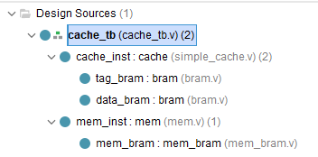
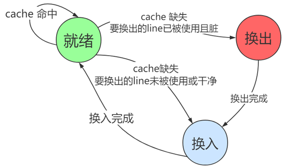
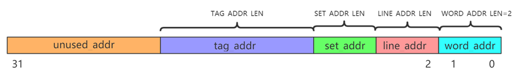

# <strong>实验代码解析</strong>

!!! warning "实验代码下载"
    
    [实验代码下载请点这里](./src/lab7.zip)

## <strong>实验前准备</strong>

相较于之前的实验，本次实验将没有指令集的区别，因此选择 LA 或是 RV 的同学都要做相同的准备工作，实验任务也相同。

考虑到本次实验的难度，我们提供了[基础代码](./src/lab7.zip)，其中包含：

```shell
lab7
│  generate_tb.py   #仿真文件生成脚本
│
└─src
        bram.v      #BRAM模块
        cache_tb.v  #由脚本生成的仿真文件
        mem.v       #主存模块
        mem_bram.v  #由脚本生成的主存内部存储BRAM模块
        simple_cache.v  #直接映射Cache
```
!!! Note
    
    `simple_cache.v` 为直接映射 Cache 的代码，请同学们在进行实验前先阅读代码，了解 Cache 的基本结构。

    `generate_tb.py` 为仿真文件生成脚本，同学们可以通过运行该脚本生成`cache_tb.v`，测试 Cache 的读写性能，在检查实验时，请当场使用该脚本生成tb后进行测试。

    后面实验教程中将会详细讲解如何使用这些文件。

    !!! Warning "注意"
    
        请勿在不理解代码的情况下轻易修改除了`mem.v`和`simple_cache.v`外实验提供的任何代码，否则可能会导致实验结果不符预期从而无法通过实验验收。

本次实验与先前实验相比较为独立，同学们可以自己在 vivado 上开启一个新的 project 并把实验仓库的 src 源码文件导入到 vivado 中进行仿真。请保证加入vivado后模块的层次关系如下：



## <strong>实验代码内容</strong>

实验提供的模块大概可以理解为如下框图：


其中 CPU 集成在上层的 `cache_tb.v` 中，`mem.v` 和 `mem_bram.v` 对应主存 Mem 部分，剩下 `bram.v` 和 `simple_cache.v` 构成给出的直接映射 Cache 。

本实验全部采用“写回+写分配”的cache策略，这种策略在读或写命中时，直接从cache中读写数据，只需要一个时钟周期，不需要对CPU流水线进行stall；

!!! Warning "注意"
    这里需要一个时钟周期指的是，Cache会在下一个周期把数据读出/写入。(注意 BRAM 的时序条件，和分布式存储器能异步读取不同，BRAM 的读写均是时钟同步的)

在发生缺失时，读缺失和写缺失的处理方法是相同的，都是从主存中换入缺失的line（line即块）到cache中（当然，如果要换入的line已经被使用了，并且脏，则需要在换入之前进行换出），再从cache中读写数据。总结下来，cache应该维护如下的状态机：



我们提供的简单直接映射的cache中就有这样的状态机。当没有读/写请求时，cache保持待机状态，当CPU发出读/写请求时，cache检查是否命中，如果命中则立刻响应读/写请求。如果缺失，则进行换入（换入之前可能需要先换出），在cache进行换出换入时，cache无法响应CPU当前的读写请求，因此需要向CPU发出miss=1的信号，CPU需要使用该信号控制所有流水段进行stall。直到cache完成换出换入后重回就绪状态，此时cache就能响应这个读写请求。

### Cache对外接口与时序

现在，让我们暂时把cache当作黑箱，看看它对外的接口和时序是怎样的。我们提供的简单cache的对外接口如下。当你对cache进行修改时，也要遵循这个接口和时序。

```verilog
module cache #(
    parameter INDEX_WIDTH       = 3,    // Cache索引位宽 2^3=8行
    parameter LINE_OFFSET_WIDTH = 2,    // 行偏移位宽，决定了一行的宽度 2^2=4字
    parameter SPACE_OFFSET      = 2,    // 一个地址空间占1个字节，因此一个字需要4个地址空间，由于假设为整字读取，处理地址的时候可以默认后两位为0
    parameter WAY_NUM           = 1     // Cache N路组相联(N=1的时候是直接映射)
)(
    input                     clk,    
    input                     rstn,
    /* CPU接口 */
    // 注意：这里的 CPU 是集成在 cache_tb.v 中的，大家不需要真的将 cache 连接到 CPU 上。  
    input [31:0]              addr,   // CPU地址
    input                     r_req,  // CPU读请求
    input                     w_req,  // CPU写请求
    input [31:0]              w_data,  // CPU写数据
    output [31:0]             r_data,  // CPU读数据
    output reg                miss,   // 缓存未命中
    /* 内存接口 */  
    output reg                     mem_r,  // 内存读请求
    output reg                     mem_w,  // 内存写请求
    output reg [31:0]              mem_addr,  // 内存地址
    output reg [127:0] mem_w_data,  // 内存写数据 一次写一行
    input      [127:0] mem_r_data,  // 内存读数据 一次读一行
    input                          mem_ready  // 内存就绪信号
);
```

由于我们Cache中存储Tag和Data均使用Bram进行实现，因此Cache在接受到来自CPU的读/写请求时，需要花费一个周期去读取对应索引index的Tag和Data，并与请求地址addr中分离出的tag进行比对：

- 如果相同则为hit，miss信号为0；
- 如果不同，miss信号变为1，此时代表cache未命中，此时CPU会stall住所有行为，将当前请求信号保持到miss变为0（注意此时cpu的请求信号与cache当前正在处理的信号并不是一个信号）

### 主存时序

主存代码由我们提供，它被我们提供的简单cache所调用，是使用BRAM模仿的DDR。包括mem.v与mem_bram.v两个文件，顶层文件是mem.v，它以line为读写单元，（而不是以word为读写单元），且读写周期很长，本实验设置为50个时钟周期。

!!! Warning "注意"

    主存的读写周期很长，本实验设置为50个时钟周期，但是为了方便测试，可以在仿真的时候给mem.v中的cnt_max设置为5或者其他来减少仿真时间。

mem.v的输入输出接口定义如下

```verilog
module mem#(
    parameter INDEX_WIDTH       = 3,    // Cache索引位宽 2^3=8行
    parameter LINE_OFFSET_WIDTH = 2,    // 行偏移位宽，决定了一行的宽度 2^2=4字
    parameter SPACE_OFFSET      = 2,    // 一个地址空间占1个字节，因此一个字需要4个地址空间，由于假设为整字读取，处理地址的时候可以默认后两位为0
    parameter MEM_ADDR_WIDTH    = 10,   // 为了简化，这里假设内存地址宽度为10位（CPU请求地址仍然是32位，只不过我们这里简化处理，截断了高位） 
    parameter WAY_NUM           = 1     // Cache N路组相联(N=1的时候是直接映射)
)(
    input  clk,
    input  rstn,
    input  mem_r,
    input  mem_w,
    input  [31:0] mem_addr,
    input  [127:0] mem_w_data,  // 内存写数据 一次写一行
    output [127:0] mem_r_data,  // 内存读数据 一次读一行
    output reg                         mem_ready  // 内存就绪信号
);
```

当cache发起对mem的<strong>读/写</strong>请求时，mem会延时对应的周期，在延时结束后拉高mem_ready信号，如果是读请求则会同时给出mem_r_data(注意信号宽度为一行)；如果是写请求则会在发出mem_ready信号的同时将mem_w_data写入到主存中。

### 直接映射Cache

本节的内容务必结合我们提供的cache代码去阅读。要理解cache首先要看32bit addr是如何分割的，可以参考下图：



!!! Warning "注意代码和图中示意的区别"

    我们给出的代码具体实现和上图的一些变量称呼有区别，请仔细阅读代码并注意区分，上图仅仅是为了帮助理解。

word_addr: 字节地址，即指定字节是word\(字\)中的第几个,其宽度对应代码中的SPACE_OFFSET参数。固定为2bit。为了代码简便，我们实验不考虑半字和字节的读写指令，只使用lw和sw指令做内存读写。

line_addr: line内地址，其长度由参数LINE_OFFSET_WIDTH决定。例如，如果希望每个line中有16个word，则LINE_ADDR_LEN应设为4，因为2^4=16。在cache读写过程中，line_addr用于指示要读写的word是line中的哪一个word。

!!! Note

    在代码中，word_offset对应line_addr，为了查找数据在这一行中偏移了多少个字。

set_addr: line地址，其长度由参数INDEX_WIDTH决定。例如，如果希望cache中有4个cache组，则SET_ADDR_LEN应该设置为2，因为2^2=4。在cache读写过程中，set_addr负责将读写请求路由到正确的组。

!!! Note
    
    具体实现代码中，r_index和w_index对应的地址截取就是set_addr部分，为了索引查找Cache的第几行。

tag_addr: 是该32位地址的TAG。当发生读写请求时，cache应该把32位地址中的tag_addr取出，与cache中的TAG比较，如果相等则命中。如果不等则缺失。

<del>unused_addr: 32位地址中的高位，直接丢弃。</del>（本次实验并不会出现，请将高位全部截取为Tag就好。）

!!! Note
    与图中不同的是，本次实现我们不需要考虑tag的长度，将高位全部截取为Tag就好。

具体关于这部分地址处理的代码如下：

```verilog
// 对输入地址进行解码
assign r_index = addr[INDEX_WIDTH+LINE_OFFSET_WIDTH+SPACE_OFFSET - 1: LINE_OFFSET_WIDTH+SPACE_OFFSET];
assign w_index = addr_buf[INDEX_WIDTH+LINE_OFFSET_WIDTH+SPACE_OFFSET - 1: LINE_OFFSET_WIDTH+SPACE_OFFSET];
assign tag = addr_buf[31:INDEX_WIDTH+LINE_OFFSET_WIDTH+SPACE_OFFSET];
assign word_offset = addr_buf[LINE_OFFSET_WIDTH+SPACE_OFFSET-1:SPACE_OFFSET];
```

!!! Warning "注意"

    注意addr和addr_buf的区别，一定要搞清楚哪个地址才是cache当前在处理的请求地址。

在我们提供的简单cache中，line size可以通过调节LINE_OFFSET_WIDTH去改变，组数可以通过调节INDEX_WIDTH去改变。这里，以LINE_OFFSET_WIDTH=3，INDEX_WIDTH=2, TAG_ADDR=12为例，给出直接映射cache的结构图：


!!! Warning "该图仅供参考"
    
    在具体代码实现中我们将Tag和Data分开存储，Tag Bram中存储有效位（valid）、脏位（dirty）和标签（tag）， Data Bram中存储对应的数据行（line）。

实际上，直接映射是组相连的特殊情况，相当于1路组相连。因此每个set中只有1个line。每个 line是8个word，除此之外，每个line还需要1个TAG，一个dirty（脏位），一个valid（有效位）。

**Cache的大致工作流程如下：**

1. 当有读写请求时，根据地址中的r_index字段，决定要到哪个line中读写数据。
2. 然后，查看该line是否valid
3. 如果valid=0则一定是缺失。
4. 如果valid=1，说明这个line是有效的，需要比较这个line的tag和地址中的tag是否相同。
5. 相同则命中，不同则缺失。
6. 如果命中，则立即响应读写请求。当然，如果是写请求，要把dirty置1，表明这个line已经被修改过。
7. 如果cache缺失，要从主存中换入该块到这个cache line中。在换入前，也需要考虑是否需要先换出。如果valid=1且dirty=1，说明该cache块是有效的并且已经被修改过，则需要先进行换出，将脏块写回到主存中，再换入新的块。如果这个块是干净的，则直接换入新的块覆盖原来的块就好。

### BRAM 模块说明：

- 相较于 DRAM, 在做读操作的时候，BRAM和DRAM不同。DRAM是组合逻辑直接输出，BRAM则是时序逻辑输出。 
- 给出的 BRAM 是采取先读后写的策略，也就是说当同时读取和写入同一个地址时，会读出旧的数据而不是新的数据，请在完成实验中避免出现同时读写的这种情况。 

关于以上两点请自行阅读相关代码([bram.v](./src/bram.v) / [mem_bram.v](./src/mem_bram.v))理解。

### 仿真测试文件生成 generate_tb.py

我们提供了一个测试文件生成脚本 generate_tb.py，用于生成测试文件 cache_tb.v，该文件用于测试 Cache 的读写性能，其中可以调试的参数如下：

```python
# 定义一些仿真文件参数
MODE = 0 # 0:随机读写 1：模拟CPU伪顺序读写（会有不定期跳转，概率为BranchP）
BranchP = 0.1 # 跳转概率，仅在MODE=1时有效，当BranchP = 0时，为顺序读写不会跳转
READ_NUM   = 2000 # 读取次数
WRITE_NUM  = 1000 # 写入次数

# 内存参数
WORD_WIDTH = 32 # 内存数据宽度
DATA_WIDTH = 128 # 一行数据宽度

# cache参数
INDEX_WIDTH = 3
LINE_OFFSET_WIDTH = 2
SPACE_OFFSET = 2
MEM_ADDR_WIDTH = 10
WAY_NUM = 1
```
请确保参数和你自己的cache参数一致，否则可能会导致仿真失败。

!!! Danger "一定要注意文件的生成替换"

    请一定要在python脚本所在的目录下运行该脚本，否则可能会出现文件路径错误。运行后该python脚本会在其所在目录下src文件夹中生成cache_tb.v和mem_bram.v文件，请一定要注意这两个文件的生成替换，以免出现错误。（按理来讲应该保持实验代码的原始性，不应该修改文件的相对位置，在创建项目是直接导入 src 文件夹即可，注意勾选不要复制文件到项目中）


!!! Note

    MODE = 0 会生成随机读写序列，适用于测试 Cache 的正确性， 因为在这种情况下，Cache 的替换策略会被充分测试；
    
    而 MODE = 1 会生成伪顺序读写序列，适用于测试 Cache 的性能，因为在这种情况下，Cache 的命中率会很高，便于你在实验报告中分析不同替换策略的优劣。

!!! Warning "注意"
    
    注意在N路组相连的仿真过程中，如果N过大，可能导致Cache容量大于内存容量从而出现无法完全验证各种情况的问题，请将 generate_tb.py 中的 MEM_ADDR_WIDTH 调大一些， 以便调大内存容量。

    这部分需要你自己斟酌，计算Cache大小，调整主存大小，一般来讲，主存大小应该要远远大于Cache大小。

### 测试文件 cache_tb.v 中常用 debug 信号说明，便于同学们仿真:

- op: 0表示读，1表示写，代表当前周期中cache应该提交的操作。
- data: 代表当前周期中cache应该提交的数据。（注意，我们只检测读取的数据是否正确，写入操作时data为应该写入的数据，没有什么意义）
- diff: 默认为0，当读取的数据与应该读取的数据不同时，diff会被置为1，代表读取错误，用于定位错误
- test_cnt: 代表当前的测试周期，用于定位错误（不过由于cache是相当于流水一级的，这里的cnt相当于领先一个周期，cache在处理的地址和数据都是 test_cnt-1 时的地址和数据）
- 其余信号还请同学们自行[阅读代码](./src/cache_tb.v)理解。