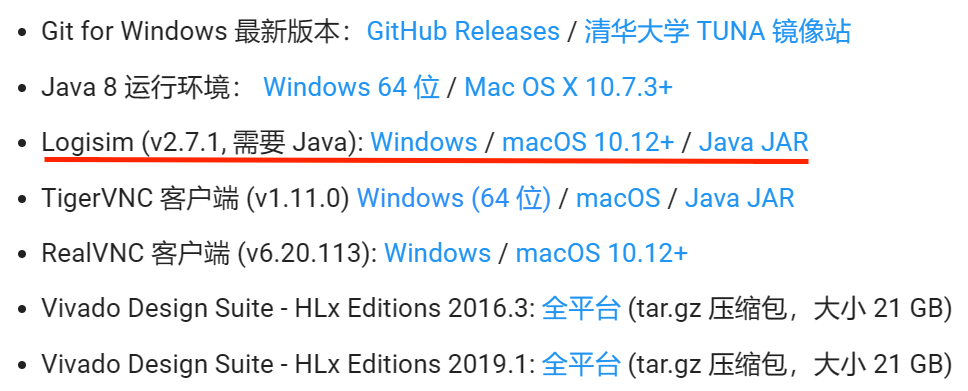
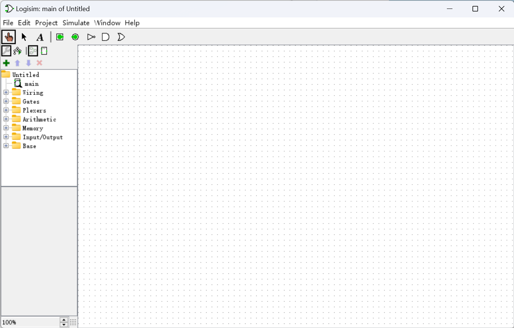
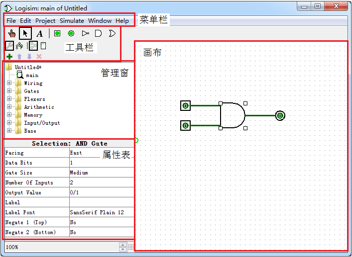
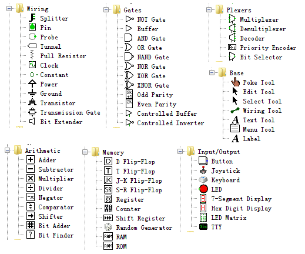
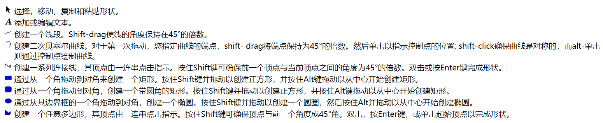

# <strong>Logisim 使用教程</strong>

Logisim 是一种用于设计和仿真数字逻辑电路的教学仿真工具。其特点包括：操作简单，界面直观，通过简单的鼠标拖拽连线即可完成数字电路设计和仿真，子电路封装功可以让用户更可以方便地构建更大规模的数字电路。因此，可以使用 Logisim 来设计和仿真用于相关课程的硬件电路，达到教学的目的。

本学期的实验中，Logisim 将不作为必修的实验内容出现，但我们依然鼓励大家学习如何使用 Logisim。它以一种非常直观的方式展现了数字电路的设计与功能，为学习数电以及后续的硬件课程奠定了良好的基础。

## <strong>搭建 Logisim 实验环境</strong>
### <strong>获取 Logisim</strong>

你可以通过多种渠道使用 Logisim。

- 如果想在自己的电脑上搭建 Logisim 实验环境，可在 Vlab 平台下载与用户操作系统相匹配的 jre 软件和 Logisim。步骤如下：进入 Vlab 首页，依次点击使用文档 $\rightarrow$ 资源下载即可进入如图所示的下载界面。也可以直接点击[链接](https://vlab.ustc.edu.cn/docs/downloads/)跳转。

    <figure markdown>
    { width="600" }
    <figcaption>Vlab 资源下载界面</figcaption>
    </figure>

- 如果选择在实验室的机房进行实验，可以在实验室机房内电脑上加载<strong>硬件实验</strong>模板，即可直接获取 Logisim 环境。

- 如果想使用我们提供的在线环境，可以在 [Vlab 平台](https://vlab.ustc.edu.cn/ )（ 选择统一身份认证登录）的<strong>虚拟机管理</strong>目录下新建一个支持图形界面的 ubuntu 环境，上面已经预装了 Logisim。

如果你想阅读更多有关信息，欢迎访问 [Logisim 官方网站](http://www.cburch.com/logisim/)与[官方资源下载站](https://sourceforge.net/projects/circuit/files/)。

### <strong>获取 Java</strong>

Logisim 基于 Java 环境，在安装了 Java 运行环境的电脑上都可以正常使用。同样地，你可以在 Vlab 平台上获取 Java 的有关资源。
由于篇幅有限，大家可以参考[这篇博客](https://blog.csdn.net/weixin_45710060/article/details/123315280)中的相关内容或其他教程进行下载与安装。

安装完毕后，便可双击 Logisim 可执行文件启动 Logisim 工具。你将看到下图所示的主界面：

<figure markdown>
  { width="600" }
</figure>

## <strong>熟悉 Logisim 界面</strong>

Logisim 主界面包括 5 大部分：菜单栏、工具栏、管理窗、属性表以及画布。

<figure markdown>
  { width="600" }
</figure>

<strong>画布区域</strong>是用户绘制电路的窗口，也是我们最经常使用的区域。

<strong>管理窗口</strong>提供所有的基本组件，以文件夹目录形式显示。其中第一个目录为用户目录。用户所设计的电路都显示在这一级目录下，用户可在该文件夹目录上单击鼠标右键，选择 Add Circuit 添加新的电路设计。

<strong>属性表</strong>为当前选中组件的基本属性，用户可以根据需要修改其属性参数，如大小、端口数目、方向等。

<strong>菜单栏</strong>中除打开关闭文件等基本操作外，其它功能我们可以暂不了解，等需要用到的时候再深入研究。

<strong>工具栏</strong>是最为常用的部分，因此我们单独进行介绍。下图所示的工具栏包括四大类组件。其中：

<figure markdown>
  { width="600" }
</figure>

 - <strong>红色框</strong>中包括三种工具。左侧的手形工具为<strong>操作模式</strong>按钮，用于改变电路中选定组件的值；中间的箭头工具为<strong>编辑模式</strong>按钮，用于编辑组件或者添加电路；右侧的文本工具（字母 A）用于在电路中添加文字描述。

 - <strong>绿色框</strong>中为几种常用基本电路组件的快捷方式，从左到右分别为输入引脚、输出引脚、非门、与门和或门。这几种组件也可以在管理窗口内找到。

 - <strong>深蓝色框</strong>中的按钮用于切换左侧管理窗的显示内容，扳手工具用于显示工程电路和库文件，树状结构用于显示仿真电路的层次结构。

 - <strong>浅蓝色框</strong>中的按钮用于切换查看电路结构和模块封装结构。

## <strong>Logisim 基本操作</strong>

在打开 Logisim 后，程序会默认创建新电路窗口，我们便可以在这里进行电路图的绘制。任何时候按下 Ctrl+S 即可快速保存当前电路图（文件扩展名为 .circ）。

<figure markdown>
  { width="600" }
</figure>

单击左上角的 File 菜单，即可展开更多文件相关的选项。

<figure markdown>
  { width="600" }
</figure>

接下来我们将尝试绘制一个基本的非门电路。首先，单击工具栏中的输入引脚，
移动<strong>（不是拖动）</strong>鼠标到窗口界面中，再次单击将其放下。输出引脚的操作同理。

<figure markdown>
  { width="600" }
  <figcaption>放置输入引脚与输出引脚</figcaption>
</figure>

如图所示，方形的为输入引脚，用户可以在操作模式下通过单击更改其输入的值；圆形的为输出引脚，用于显示当前电路的输出结果。由于此时输出引脚并没有被连接到电路中，因此输出为蓝色的 X（即不确定值）。

为了让输出引脚输出确定的结果，我们可以将其与输入引脚直接相连。在编辑模式下，鼠标悬停在输入引脚的绿色标记点上，待出现标记后按住左键，拖动鼠标，松开后即可绘制连线。连线可以分支、转弯等。

<table><tr>
<td><figure>

<figcaption>出现识别标记</figcaption>
</figure></td>

<td><figure>

<figcaption>连接完成</figcaption>
</figure></td>
</tr>

<tr>
<td><figure>

<figcaption>连线可以转弯</figcaption>
</figure></td>

<td><figure>

<figcaption>连线可以分支</figcaption>
</figure></td>
</tr></table>

如果你发现连线位置错误，或者出现了多余的连线，可以通过 Ctrl+Z 撤销上一步操作，或单击选中连线并按下 Delete 键以将其删除。此外，你还可以沿着连线拖动它的一个端点以『扩展』或『缩短』连线。

现在我们的输出引脚已经可以正确输出了，它时刻输出与输入引脚相同的结果。你可以在操作模式下单击输入引脚，观察输出引脚的结果变化。

<table><tr>
<td><figure>

<figcaption>输入为 1</figcaption>
</figure></td>

<td><figure>

<figcaption>输入为 0</figcaption>
</figure></td>
</tr></table>

为了得到我们想要的非门，我们可以使用 Logisim 提供的非门组件。如图所示，在管理窗格的 Gates 文件夹下选中 NOT Gate，通过与输入输出引脚相同的操作插入到窗口中。这样，一个最简单的非门就搭建好了！

<table><tr>
<td><figure>

<figcaption>通过管理窗格插入非门</figcaption>
</figure></td>
</tr><tr>
<td><figure>

<figcaption>非门电路的搭建</figcaption>
</figure></td>
</tr></table>

???+ Note "Tips"

    除了管理窗格，我们也可以在上方工具栏，即输入输出引脚的旁边选中非门进行绘制。

那么如何画一个竖着的非门呢？首先，我们需要调整器件的方向。在编辑模式下点击输入引脚，在左侧的属性表中将 Facing 属性改为 South。此时输入端口就朝向了下方。

<figure markdown>
  { width="500" }
</figure>

同样地，非门和输出引脚也可以调整方向。最终我们就得到了下图所示的竖着的非门。

<figure markdown>
  { width="200" }
</figure>

除了基础的非门电路，大家可以自行了解：按钮、LED、输入管脚、输出管脚、多位宽信号、探针、分线器、基本逻辑门等各类组件的作用与使用效果，以及不同颜色的线缆所代表的含义。

此外，Logisim 所支持的组件都可以在管理窗内的各个文件夹里面找到。每个组件都有其对应的参数，用户可根据需要进行修改。

<figure markdown>
  { width="600" }
  <figcaption>Logisim 组件一览</figcaption>
</figure>

<figure markdown>
  { width="600" }
  <figcaption>Logisim 组件使用简介</figcaption>
</figure>

关于各组件的具体功能及使用方法，用户可自行体验。如有问题，可查阅菜单栏 Help 下的 Tutorial 和 User's Guide 等文档,里面对 Logisim 的使用方法、功能特性以及各组件的使用都有非常详尽的说明。

对于数字电路的初学者来说，可以先学习 Logisim 中组合逻辑相关的组件，时序逻辑相关的组件可在具备了相关的知识储备后进行，这样会相对轻松一些。

## <strong>Logisim 模块封装</strong>

每个 Logisim 项目实际上都是一个电路库。在最简单的情况下，每个项目只有一个电路（默认情况下为 main）。面对更为复杂的电路设计时，我们可以使用多个电路文件（也就是模块）共同实现，每一个子电路只负责一部分特定的功能。

在 Logisim 中，新建一个新的电路文件命名为 Add，并绘制电路结构，参考下图完成一位半加器的设计。

<figure markdown>
  { width="600" }
  <figcaption>一位半加器的电路设计</figcaption>
</figure>

???+ Question "有点疑惑？"

    上面所示的电路为啥就是一位半加器呢？我们可以从逻辑表达式入手。一位半加器的逻辑表达式为

    $\text{Sum}=a\ \text{XOR}\ b$

    $\text{Cout}=a\ \text{AND}\ b$

    （如果你不清楚上面的式子是如何得到的，可以列出真值表进行推算）

    不难发现，电路图中的异或门和与门恰好与逻辑表达式相对应。

???+ Note "Tips：修改属性"

    你可能会发现自己放置的异或门与图中的不太一致，此时可以单击选中异或门，在左下方的<strong>属性表</strong>中修改该异或门的属性，例如输入端口数目、大小、朝向、标签名等。

在电路处于打开状态时（画布区域显示该电路结构，且管理窗口中该电路图标上有一个放大镜标志），点击工具栏中的编辑电路封装图标（下图中的红色框），进入电路封装编辑页面。你可以修改电路的边框形状及大小、端口位置、名称等。下面是一些关键的元素：

- 锚点：连着一根线的绿色圆圈。它对应着你放置子电路时十字准星与电路的相对位置与朝向。
- 端口：蓝色的点。它对应着电路的输入和输出引脚。你可以通过点击端口查看它与引脚的对应情况。
  
上方的工具栏是一些可用的电路封装工具，它们的介绍如下图所示：

<figure markdown>
  { width="700" }
</figure>

下面是一位半加器的模块封装参考：

<figure markdown>
  { width="600" }
</figure>

如上图所示修改电路封装样式，并对管脚添加文字注释。完成电路封装编辑后保存，即可在其它电路文件中使用该模块。你可以在管理窗格中直接点击所需的模块，移动鼠标到画布中，即可得到该模块的一个副本。例如，我们可以按照下图的方式用两个一位半加器搭建一位全加器。

<figure markdown>
  { width="600" }
  <figcaption>使用一位半加器搭建的一位全加器</figcaption>
</figure>

同样地，我们也可以对一位全加器进行封装，在另一个电路文件中以此为基础搭建 32bits 位宽的全加器。

???+ Info "注意"

    在硬件电路中，模块可以嵌套调用（A 调用 B，B 又调用 C），但不能循环调用（A 调用 B，B 又调用 A）或递归调用（模块调用自身）。

!!! Success "休息一会儿"

    本部分内容到此结束！你理解了多少呢？

!!! Quote "参考资料"

    - [Logisim 官方网站](http://www.cburch.com/logisim/)